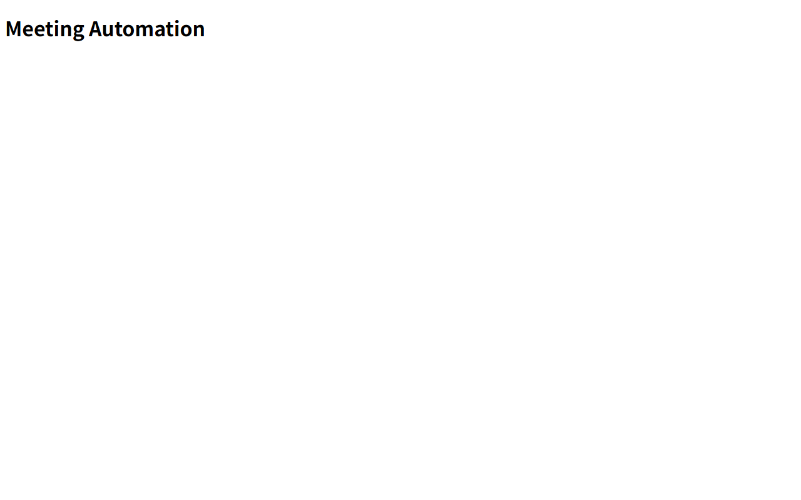

# 검증 증거

## 🧭 작업 정보

- 작업: `TASK-001.02` Frontend 도구 체계 초기화와 기본 렌더 검증
- Issue: [#2](https://github.com/donghyunlee-dev/meeting-automation/issues/2)
- PR: [#70](https://github.com/donghyunlee-dev/meeting-automation/pull/70)
- 구현 검사 head: `5131fdb57252a5062735b58999f92808d90f098b`
- 작업 브랜치: `codex/issue-2-frontend-toolchain`
- Node.js: `v22.12.0`
- npm: `11.16.0`
- 실행 환경: Windows PowerShell, Chrome

## ✅ 검증 결과

- TDD 선행 실패: Vite/Vitest 실행 설정과 테스트 수집은 정상인 상태에서 `App`에 제목이 없을 때 렌더 테스트 1건이 `expected null not to be null` assertion 실패를 냈다. 설정/import 오류가 아니었다.
- 최소 구현: `App`에 `Meeting Automation` h1을 추가한 뒤 같은 테스트가 통과했다.
- 잠금 파일 재설치: Node 22.12.0에서 `npm ci` 성공.
- 테스트: `npm run test` 성공, 1 test passed. `vitest run`으로 대기 없이 종료한다.
- 정적 검사: `npm run lint` 성공.
- 빌드: `npm run build` 성공. Vite `7.3.7`이 `frontend/dist/`에 산출물을 생성했다.
- 개발 서버: `npm run dev -- --host 127.0.0.1 --port 5173` 성공. Chrome에서 `http://127.0.0.1:5173/`를 열어 `Meeting Automation` 제목을 확인했다.
- 수동 QA 캡처: Chrome에서 확인한 기본 화면을 저장했다.


- 의존성 감사: `npm audit` 결과 취약점 0건. 초기 도구 버전에서 확인된 취약 항목은 Node 22.12/Vite 7 호환을 검증해 Vitest 5.0.3 및 TypeScript-ESLint 8.55.0으로 올린 뒤 해소했다.
- ESLint 9.39.5는 Node 22.12를 포함하는 명시된 런타임 범위에서 설치·실행 가능한 최신 ESLint major 9 버전이다. ESLint 10의 공식 Node 조건은 22.13 이상이라 이 작업의 `engines.node` 조건을 임의로 좁히지 않았다.
- Secret 경계: Frontend 소스와 설정에 Secret, API credential 또는 환경 설정 파일이 없다.
- `git diff --check`: 통과.

## 🧪 검증 명령

Node 22.12.0 실행 파일과 npm 11.16.0 CLI로 Frontend 작업 디렉터리에서 다음을 실행했다.

```powershell
node --version
npm --version
npm ci
npm run test
npm run lint
npm run build
npm audit
npm run dev -- --host 127.0.0.1 --port 5173
```

현지 npm 설정은 `esbuild` postinstall 승인 대기 경고를 출력했지만 설치와 테스트, 빌드가 모두 성공했다. npm은 취약점 0건을 보고했다.
