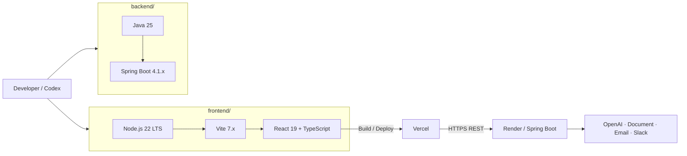
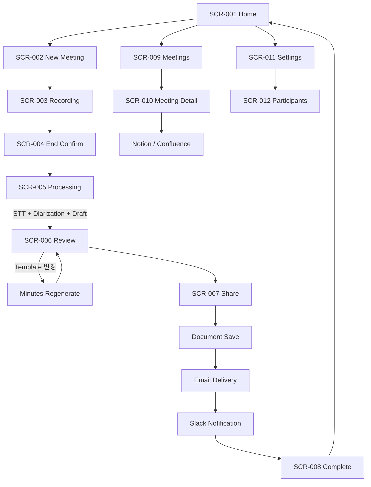
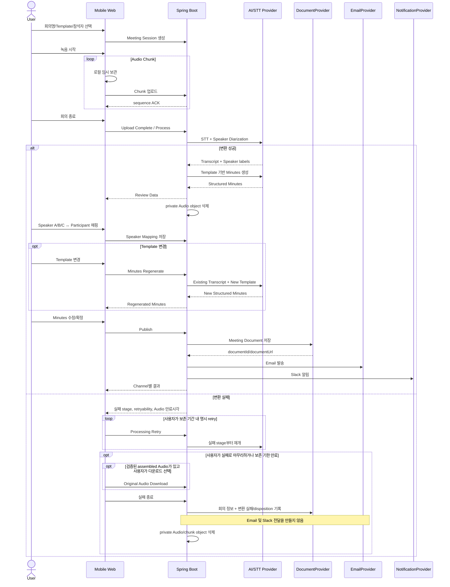
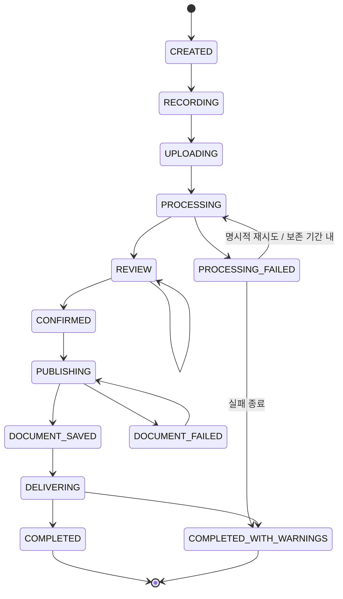
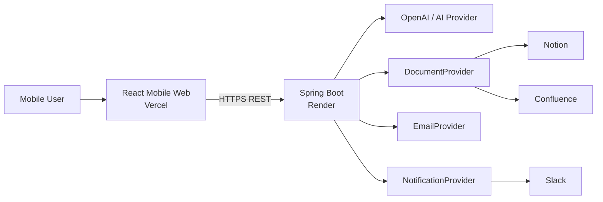
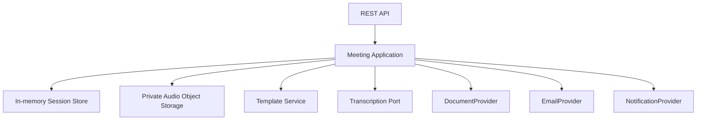
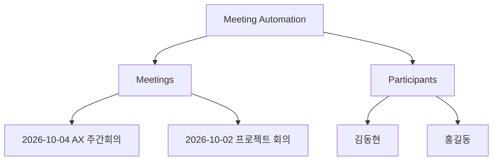

# Meeting Automation Product Requirements Document

> **문서 ID:** PRD-MA-001\
> **버전:** 1.8.1\
> **기준일:** 2026-10-06\
> **상태:** Approved Baseline Candidate\
> **문서 역할:** Meeting Automation V1의
> 제품·UX·디자인·아키텍처·데이터·API·개발 일정 Single Source of Truth\
> **대상:** Product Owner, Frontend, Backend, QA, Codex\
> **기술 기준:** React Mobile-first Web / Vercel, Java 25 / Spring Boot 4.1.x
> / Render\
> **운영 전제:** 단일 회사, 누적 회의 100개 미만

## 구현 상세 문서

이 PRD는 제품 범위와 확정 의사결정의 기준 문서다. 구현 상세는 아래 문서를 함께 참조한다.

- [Architecture](./architecture.md): 시스템 경계, 구성요소, 흐름, 운영 설계
- [Data Specification](./data-spec.md): 표준 모델, 저장 위치, 수명주기
- [API Specification](./api-spec.md): Frontend/Backend REST 계약
- [Integrations](./integrations.md): 외부 Provider Port와 Adapter 계약
- [UI Design](./ui-design.md): A안 기반 화면·컴포넌트·시각 토큰 명세

개발 PC 설정 순서는 [Frontend Setup](../setup/frontend-setup.md)과 [Backend Setup](../setup/backend-setup.md)을 따른다.
>
> **변경 이력 v1.2.0:** Backend 기준을 Java 25 / Spring Boot 4.1.x / Gradle 9.x로 갱신\
> **변경 이력 v1.3.0:** Phase 실행 계획을 테스트 우선의 세부 TASK와 FE/BE 의존 순서로 분해하고 GitHub Issue·QA 증거 운영 기준 추가\
> **변경 이력 v1.4.0:** TASK별 SDD 문서 설계 상태·경로 추적 기준과 스킬의 선택적 문서 확인 절차 추가\
> **변경 이력 v1.5.0:** 설계 진행 커서를 추가해 다음 문서 작업을 직접 지정하고, 세션별 순차 재탐색을 금지\
> **변경 이력 v1.6.0:** 상세 설계 문서와 PRD 상태를 기본 브랜치에 커밋·푸시한 뒤에만 설계 완료로 처리\
> **변경 이력 v1.6.1:** Confluence Cloud Basic 인증과 Backend 계정 이메일 설정을 확정\
> **변경 이력 v1.6.2:** Document Provider 미선택 상태와 공통 Integration Health 응답 규칙을 확정\
> **변경 이력 v1.7.0:** Participant를 회의 작성자 지정형 `{id,name,email}` roster로 정의\
> **변경 이력 v1.8.0:** 처리 실패 시 사용자 명시 재시도, Audio 24시간 임시 보존·다운로드·실패 문서 종료와 참석자 전달 억제 규칙 추가\
> **변경 이력 v1.8.1:** 변환 실패 Audio를 비공개 객체 저장소에 최대 24시간 보존해 재시도·다운로드를 지원하고 만료 정리를 추가\
> **변경 이력 v1.1.0:** Technology Baseline 확정, Monorepo/Node.js/React/Spring Boot 역할 명시, 실제 모바일·회의실 품질 검증을 개발 선행 Gate에서 Phase 8로 이동

------------------------------------------------------------------------

## 1. 문서 운영 원칙

이 문서는 Meeting Automation V1 개발의 최상위 구현 기준이다. Codex를
포함한 개발 주체는 작업 시작 전에 관련 `DEC-*`, `FR-*`, `NFR-*`,
`SCR-*`, `API-*`, `TASK-*`를 확인한다.

### 1.1 ID 체계

  Prefix     의미
  ---------- ----------------------------------
  `DEC-*`    변경 통제가 필요한 확정 의사결정
  `FR-*`     기능 요구사항
  `NFR-*`    비기능 요구사항
  `SCR-*`    화면
  `API-*`    Backend REST API
  `EXT-*`    외부 Provider 연동 계약
  `TASK-*`   개발 작업 묶음 및 실행 작업 (`TASK-001.01` 형식의 세부 작업 포함)
  `ERR-*`    표준 오류

### 1.2 작업 상태

`TODO → IN_PROGRESS → VERIFY → DONE`

예외 상태는 `BLOCKED`, `CANCELLED`다.

-   `DONE`인 세부 TASK는 다시 구현하지 않는다. 상위 TASK는 모든 자식 TASK가 `DONE`일 때 완료로 본다.
-   변경이 필요하면 기존 TASK를 TODO로 되돌리지 않고 변경 TASK를 새로
    만든다.
-   DONE은 코드 작성만으로 인정하지 않는다. 테스트/화면/연동 등 TASK별
    Verification Evidence가 있어야 한다.
-   설계 변경은 먼저 이 PRD의 관련 ID와 Traceability를 갱신한다.

------------------------------------------------------------------------

# 2. 서비스 정의

Meeting Automation은 **사내 오프라인 회의를 스마트폰 웹에서 녹음하고,
음성을 STT와 Speaker Diarization으로 변환한 뒤 사용자가 화자와 참석자를
매핑하여 회의록을 생성·검토하고, 지정된 문서 플랫폼에 저장한 후 Email로
전달하고 Slack으로 알림을 제공하는 내부 서비스**다.

범용 Meeting Intelligence 플랫폼을 목표로 하지 않는다. 핵심 사용 경험은
다음과 같다.

> **스마트폰을 회의 테이블 중앙에 놓고 → 회의를 녹음 → 자동으로 정리 →
> 사람만 확인 → 저장·공유**

## 2.1 목표

1.  오프라인 회의 기록을 최소 조작으로 시작한다.
2.  녹음 종료 후 STT, Speaker Diarization, 회의록 생성을 자동화한다.
3.  자동 실명 음성 인식 대신 `Speaker A/B/C`를 참석자와 간단히 매핑한다.
4.  생성 결과를 사용자가 검토하고 수정할 수 있다.
5.  같은 Transcript에서 Template만 변경하여 회의록을 재생성할 수 있다.
6.  최종 회의록을 Notion 또는 Confluence에 영구 저장한다.
7.  참석자에게 Email로 전달한다.
8.  Slack은 보조 알림 채널로 사용한다.
9.  별도 애플리케이션 DB 없이 100개 미만의 회의 이력을 조회한다.
10. Document, Email, Notification 연동은 Provider 공통 계약을 통해 교체
    가능하게 한다.

## 2.2 비목표

-   실시간 자막
-   Google Meet/Teams/Zoom Bot
-   Calendar 연동
-   자동 실명 화자 인식/Voiceprint
-   네이티브 iOS/Android 앱
-   멀티테넌시
-   사용자별 Integration
-   100개 이상 회의 확장 설계
-   검색 인덱스
-   애플리케이션 DB/JPA/Redis/Queue/Batch
-   과거 회의록의 앱 내부 편집
-   음성 원본 장기 보관
-   Notion Database/Data Source 종속 기능
-   복잡한 관리자 Dashboard

------------------------------------------------------------------------


# 3. Technology Baseline

이 절은 Codex가 프로젝트 생성·의존성 선택·빌드 도구를 임의 변경하지 않도록 하는 **개발 기술 기준선**이다.

## 3.1 Monorepo

V1은 하나의 Git Repository에서 Frontend, Backend, 문서를 함께 관리한다.

```text
meeting-automation/
├─ frontend/                 # React Mobile-first Web
│  ├─ package.json
│  ├─ src/
│  └─ ...
├─ backend/                  # Spring Boot API / Integration Backend
│  ├─ build.gradle
│  ├─ settings.gradle
│  ├─ src/
│  └─ ...
├─ docs/
│  ├─ PRD.md
│  ├─ ADR/
│  └─ evidence/
├─ .gitignore
└─ README.md
```

Monorepo는 소스와 개발 기준을 한 Repository에서 관리하기 위한 방식이다. Frontend와 Backend의 빌드 및 배포 단위는 서로 독립적이다.

## 3.2 Frontend Baseline

| 항목 | 기준 |
|---|---|
| Runtime / Build | Node.js 22 LTS |
| Package Manager | npm |
| UI | React 19 |
| Language | TypeScript 5.x |
| Build Tool | Vite 7.x |
| Routing | React Router |
| Lint | ESLint |
| Unit/Component Test | Vitest |
| Deployment | Vercel |

**Node.js는 서비스 Backend가 아니다.** Node.js는 React/Vite의 개발·빌드 Toolchain으로만 사용한다. 업무 API, Secret, OpenAI, Document, Email, Slack 연동은 Spring Boot Backend가 담당한다.

## 3.3 Backend Baseline

| 항목 | 기준 |
|---|---|
| Language | Java 25 |
| Framework | Spring Boot 4.1.x |
| Build | Gradle 9.x (JDK 25 실행 기준 최소 9.1) |
| REST | Spring Web |
| Validation | Jakarta Bean Validation / Spring Validation |
| Health | Spring Boot Actuator |
| External HTTP | Spring RestClient 또는 Apache HttpClient5 |
| Test | JUnit 5 |
| Deployment | Render |
| Database | 없음 |
| JPA | 사용하지 않음 |
| Redis | 사용하지 않음 |
| Queue/Message Broker | 사용하지 않음 |

외부 HTTP Client는 Adapter별로 난립시키지 않는다. 프로젝트 초기 설정에서 `Spring RestClient` 또는 `Apache HttpClient5` 중 하나를 기본 방식으로 선택하고 이후 동일 기준을 유지한다.

## 3.4 Runtime 역할



핵심 실행 구조는 다음과 같다.

```text
Browser
  ↓
React / TypeScript
  ↓ HTTPS REST
Spring Boot 4.1.x / Java 25
  ├─ OpenAI
  ├─ Notion / Confluence
  ├─ Email
  └─ Slack
```

## 3.5 버전 운영 규칙

- 위 Major 기준을 Codex가 임의로 변경하지 않는다.
- 고정 minor가 있는 `4.1.x` 항목은 해당 minor 라인의 호환 가능한 최신 patch를 선택한다. Java 25로 Gradle을 실행할 때는 Gradle 9.1 이상을 사용한다.
- Major 변경은 PRD 또는 ADR 승인 후 진행한다.
- Frontend와 Backend는 Monorepo에 있지만 독립적으로 build/test/deploy 가능해야 한다.

# 4. 확정 의사결정

  -----------------------------------------------------------------------
  ID                                  결정
  ----------------------------------- -----------------------------------
  `DEC-001`                           V1은 단일 회사 서비스다.

  `DEC-002`                           누적 회의는 100개 미만으로 고정
                                      가정하며 규모 확장을 설계하지
                                      않는다.

  `DEC-003`                           Frontend는 React Mobile-first Web을
                                      Vercel에 배포한다.

  `DEC-004`                           Backend는 Java 25 / Spring Boot 4.1.x를
                                      Render에 배포한다.

  `DEC-005`                           V1은 DB, JPA, Redis, Queue, Batch를
                                      사용하지 않는다.

  `DEC-006`                           Notion 또는 Confluence가
                                      회의록/참석자의 Source of Truth다.

  `DEC-007`                           스마트폰을 회의 테이블 중앙에 두고
                                      브라우저 마이크로 녹음한다.

  `DEC-008`                           STT 후 Speaker Diarization을 수행해
                                      `Speaker A/B/C...`를 얻는다.

  `DEC-009`                           자동 실명 화자 인식은 하지 않는다.
                                      사용자가 Speaker를 선택된 참석자와
                                      1회 매핑한다.

  `DEC-010`                           Speaker mapping은 해당 Speaker의
                                      Transcript 전체에 일괄 적용한다.
                                      Segment마다 사람을 수동 지정하는
                                      UX는 금지한다.

  `DEC-011`                           Template 변경 시 STT를 다시
                                      실행하지 않고 기존 Transcript로
                                      Minutes만 재생성한다.

  `DEC-012`                           Template은 `default.md`,
                                      `project.md` 두 개를 Backend static
                                      resource로 관리한다.

  `DEC-013`                           Document 계층은
                                      `Meeting Automation > Meetings`,
                                      `Participants`만 사용한다.

  `DEC-014`                           Notion/Confluence 공통화를 위해
                                      Page hierarchy/basic CRUD를
                                      기준으로 한다.

  `DEC-015`                           Email은 기본 전달 수단이고 Slack은
                                      Secondary Notification이다.

  `DEC-016`                           과거 회의는 앱에서 읽기 전용이며
                                      수정은 원문 Document Provider에서
                                      한다.

  `DEC-017`                           Secret은 Backend에서만 사용한다.

  `DEC-018`                           오류는 PROCESSING, DOCUMENT, EMAIL,
                                      NOTIFICATION 네 종류로 운영
                                      분류한다.

  `DEC-019`                           Admin 운영 오류는 Slack Admin
                                      채널로 알린다.

  `DEC-020`                           원본 Audio는 처리용 임시 데이터다.
                                      성공 시 Review 진입 때 삭제하고,
                                      실패 시 비공개 객체 저장소에 마지막
                                      실패부터 24시간 내 재시도/다운로드
                                      용도로 보존한 후 정리한다.
  -----------------------------------------------------------------------

------------------------------------------------------------------------

# 5. 사용자와 핵심 시나리오

## 4.1 사용자

### 회의 진행자

-   새 회의 생성
-   참석자 선택
-   녹음
-   Speaker mapping
-   회의록 검토/수정
-   Template 변경 및 재생성
-   수신자 확인
-   저장/공유

### 참석자

-   Email로 회의록 결과 수신
-   문서 링크 열람
-   필요 시 Slack 알림 확인

### 운영 관리자

-   회사 단일 Integration 설정
-   Participants 관리
-   Provider 연결 상태 확인
-   Admin Slack 오류 수신

------------------------------------------------------------------------

# 6. 서비스 프로세스

## 5.1 사용자 흐름



## 5.2 처리 시퀀스



## 5.3 세션 상태



------------------------------------------------------------------------

# 7. 시스템 아키텍처

## 6.1 System Context



## 6.2 Backend 책임

Backend는 범용 파일 저장 서버가 아니라 **Integration Gateway + Meeting
Workflow Processor**다. Audio 처리 입력과 실패 복구를 위해 제한된 기간 동안만 비공개 객체 저장소를 사용한다.



## 6.3 권장 Repository 구조

``` text
meeting-automation/
├─ frontend/
│  ├─ src/app/
│  ├─ src/features/home/
│  ├─ src/features/meeting/
│  ├─ src/features/history/
│  ├─ src/features/settings/
│  ├─ src/shared/api/
│  ├─ src/shared/ui/
│  └─ src/shared/storage/
│
├─ backend/
│  ├─ src/main/java/.../domain/
│  ├─ src/main/java/.../application/
│  ├─ src/main/java/.../adapter/in/web/
│  ├─ src/main/java/.../adapter/out/ai/
│  ├─ src/main/java/.../adapter/out/document/
│  ├─ src/main/java/.../adapter/out/email/
│  ├─ src/main/java/.../adapter/out/notification/
│  ├─ src/main/resources/templates/default.md
│  └─ src/main/resources/templates/project.md
│
└─ docs/
   ├─ PRD.md
   ├─ ADR/
   └─ evidence/
```

Domain/Application 계층은 특정 Notion/Confluence/Slack/OpenAI SDK 타입을
직접 참조하지 않는다.

------------------------------------------------------------------------

# 8. 데이터 구조

## 7.1 저장 위치

  데이터                                   위치                          영속
  ---------------------------------------- ----------------------------- ------
  회사명/Provider/Root ID                  Backend deployment config     Y
  API Key/Token/Webhook/Email credential   Render Secret                 Y
  Template                                 Backend static resource       Y
  Participants                             Document Provider             Y
  Meeting Minutes                          Document Provider             Y
  Transcript                               Meeting Document              Y
  Active MeetingSession                    Spring memory                 N
  Audio chunk/assembled audio              Browser temporary + private object storage   처리 중 유지, 성공 시 삭제, 실패 시 최대 24시간
  Meeting list cache                       memory                        N

## 7.2 MeetingSession

``` json
{
  "sessionId": "ms_xxx",
  "version": 3,
  "status": "REVIEW",
  "meeting": {
    "title": "AX 주간회의",
    "templateId": "default.md",
    "participantIds": ["pt_001", "pt_002", "pt_003"],
    "startedAt": "2026-10-04T01:00:00Z",
    "endedAt": "2026-10-04T01:45:00Z"
  },
  "speakers": [
    {"speakerId": "speaker_a", "label": "Speaker A", "participantId": "pt_001"},
    {"speakerId": "speaker_b", "label": "Speaker B", "participantId": null}
  ],
  "transcript": [
    {
      "segmentId": "seg_001",
      "speakerId": "speaker_a",
      "startMs": 0,
      "endMs": 4200,
      "text": "회의를 시작하겠습니다."
    }
  ],
  "minutes": {
    "templateId": "default.md",
    "templateVersion": "1.0.0",
    "summary": "...",
    "discussionPoints": [],
    "decisions": [],
    "actionItems": [],
    "followUps": []
  },
  "document": null,
  "deliveries": []
}
```

### 핵심 규칙

-   Transcript에는 `speakerId`를 보존한다.
-   사람 이름은 `speakerId → participantId` mapping으로 해석한다.
-   mapping 변경 시 모든 해당 segment가 즉시 같은 사람으로 표시된다.
-   Template 재생성은 `transcript`와 `speaker mapping`을 입력으로
    사용한다.
-   Template 재생성 시 Audio/STT는 호출하지 않는다.

------------------------------------------------------------------------

# 9. Document 구조

## 8.1 논리 구조



V1에서 이 외의 `Home`, `Service Info`, `History`, `Processing History`
문서를 자동 생성하지 않는다.

## 8.2 Meeting Document

``` text
2026-10-04 AX 주간회의

회의 정보
- 일시
- 참석자

회의 요약

주요 논의사항

결정사항

Action Items

후속 확인사항

Transcript
```

변환 실패로 마무리한 Meeting 문서는 일반 Minutes 대신 다음 기록을 저장한다.

``` text
회의 정보
- 일시
- 참석자

녹음 변환 결과: 실패
- 실패 단계
- 원본 Audio 처리: 다운로드 완료 또는 다운로드하지 않음
- 종료 시각
```

참석자에게 실패 기록을 Email/Slack으로 전달하지 않는다. Provider가 허용하는 최소 metadata에 실패 stage, safe error code, Audio disposition을 추가한다. 원본 오류 문구, Audio, Transcript, Secret은 저장하지 않는다.

Machine-readable metadata는 Provider가 허용하는 최소 속성/metadata를
사용한다.

필수 metadata:

``` json
{
  "schemaVersion": "1.0",
  "externalSessionId": "ms_xxx",
  "meetingAt": "2026-10-04T10:00:00+09:00",
  "templateId": "default.md",
  "participantIds": ["pt_001", "pt_002"]
}
```

## 8.3 Participant

V1 Participant는 다음만 가진다.

``` json
{
  "id": "pt_001",
  "name": "김동현",
  "email": "user@example.com"
}
```

부서, 직급, Slack ID, Voiceprint, Meeting History는 저장하지 않는다.

------------------------------------------------------------------------

# 10. Provider 공통 계약

## 9.1 DocumentProvider

``` text
validateConnection()
discoverStructure(rootId)
listMeetings(max=100)
getMeeting(documentId)
findMeetingBySessionId(sessionId)
createMeeting(command)
listParticipants()
createParticipant(command)
updateParticipant(participantId, command)
```

Provider-specific 기능을 Domain 요구사항으로 올리지 않는다.

### Notion

-   Page hierarchy
-   child page list/read/create/update
-   basic page metadata
-   Notion Database/Data Source 의존 금지

### Confluence

-   Parent/child Page hierarchy
-   child page list/read/create/update
-   basic content property/metadata

## 9.2 EmailProvider

``` text
validateConnection()
sendMeetingEmail(command)
```

Email은 참석자별 Delivery다.

## 9.3 NotificationProvider

``` text
validateConnection()
sendMeetingPublished(command)
sendAdminIncident(command)
```

Slack은 첫 구현 Adapter일 뿐 Domain 명칭이 아니다.

## 9.4 TranscriptionProvider

``` text
transcribeWithDiarization(audio)
```

표준 출력:

``` json
{
  "speakers": [
    {"speakerId": "speaker_a", "label": "Speaker A"},
    {"speakerId": "speaker_b", "label": "Speaker B"}
  ],
  "segments": [
    {
      "segmentId": "seg_001",
      "speakerId": "speaker_a",
      "startMs": 0,
      "endMs": 4200,
      "text": "..."
    }
  ]
}
```

특정 OpenAI 모델명을 PRD의 영구 계약으로 고정하지 않는다. 배포 시점에
공식 지원되는 **speaker diarization 가능한 모델/API**를 설정으로
선택한다.

------------------------------------------------------------------------

# 11. Template

## 10.1 default.md

필수 섹션:

-   회의 정보
-   회의 요약
-   주요 논의사항
-   결정사항
-   Action Items
-   후속 확인사항
-   Transcript

## 10.2 project.md

필수 섹션:

-   프로젝트/회의 목적
-   진행 현황
-   주요 논의사항
-   이슈/위험
-   결정사항
-   Action Items
-   다음 단계
-   Transcript

LLM은 가능하면 Markdown 문자열이 아니라 구조화 Minutes DTO를 반환하고
Backend가 Template에 렌더링한다.

근거 없는 결정, 담당자, 날짜를 생성하지 않는다.

------------------------------------------------------------------------

# 12. 기능 요구사항

  -----------------------------------------------------------------------
  ID                                  요구사항
  ----------------------------------- -----------------------------------
  `FR-001`                            Home에서 새 회의와 최근 회의 최대
                                      5건을 제공한다.

  `FR-002`                            회의명, Template, 참석자를 선택해
                                      MeetingSession을 생성한다.

  `FR-003`                            스마트폰 브라우저 마이크 권한을
                                      확인하고 녹음한다.

  `FR-004`                            녹음 중 경과시간과 상태, 종료
                                      버튼을 제공한다.

  `FR-005`                            종료 전 확인 Modal을 제공한다.

  `FR-006`                            Audio를 chunk 단위로 임시
                                      보관/업로드한다.

  `FR-007`                            녹음 종료 후 STT + Speaker
                                      Diarization을 수행한다.

  `FR-008`                            Processing 상태를 단계별 표시한다.

  `FR-009`                            Transcript를 기반으로 Template별
                                      Minutes 초안을 생성한다.

  `FR-010`                            감지된 Speaker A/B/C를 선택된
                                      참석자와 dropdown으로 매핑한다.

  `FR-011`                            Speaker mapping을 해당 speaker의
                                      Transcript 전체에 적용한다.

  `FR-012`                            사용자가 Minutes를 검토/수정한다.

  `FR-013`                            Template을 변경하고 기존
                                      Transcript로 Minutes를 재생성한다.

  `FR-014`                            재생성 시 STT를 다시 실행하지
                                      않는다.

  `FR-015`                            Transcript 원문을 별도
                                      Sheet/Drawer로 조회한다.

  `FR-016`                            확정 Minutes를 Document Provider에
                                      저장한다.

  `FR-017`                            Email 수신자를 확인/선택하고
                                      발송한다.

  `FR-018`                            Document 저장 후 Slack 알림을
                                      보낸다.

  `FR-019`                            Document/Email/Notification 결과를
                                      독립적으로 표시한다.

  `FR-020`                            Meetings child를 조회하여 과거 회의
                                      목록을 제공한다.

  `FR-021`                            100개 미만 목록을 브라우저에서
                                      제목/참석자로 필터링한다.

  `FR-022`                            과거 회의 상세를 앱에서 읽기
                                      전용으로 표시한다.

  `FR-023`                            원문 Notion/Confluence 열기 기능을
                                      제공한다.

  `FR-024`                            Participants를
                                      조회/추가/수정한다.

  `FR-025`                            Root에서 Meetings/Participants
                                      구조를 탐색한다.

  `FR-026`                            Provider 연결 상태를 확인한다.

  `FR-027`                            사용자가 retryable 처리 실패를 24시간 안에 명시 재시도하거나 Audio 다운로드 후 실패 마무리를 선택한다. 자동 재시도는 없다.

  `FR-028`                            처리 성공 시 Audio를 삭제하고, 변환 실패에서는 비공개 객체 저장소에 다운로드·실패 종료 기회를 위해 최대 24시간 보존 후 삭제한다.

  `FR-029`                            운영 오류를 Admin Slack으로
                                      전송한다.

  `FR-030`                            Secret 원문은 Frontend/API 응답에
                                      노출하지 않는다.
  -----------------------------------------------------------------------

------------------------------------------------------------------------

# 13. 비기능 요구사항

  -----------------------------------------------------------------------
  ID                                  요구사항
  ----------------------------------- -----------------------------------
  `NFR-001`                           Mobile-first, 360px 이상 주요
                                      모바일 폭에서 가로 스크롤이 없어야
                                      한다.

  `NFR-002`                           주요 Touch Target은 최소 44×44 CSS
                                      px를 확보한다.

  `NFR-003`                           Android Chrome, iOS Safari를 우선
                                      지원한다.

  `NFR-004`                           HTTPS를 사용하고
                                      Secret/Audio/Transcript를 일반
                                      로그에 기록하지 않는다.

  `NFR-005`                           Provider Secret은 Backend에서만
                                      사용한다.

  `NFR-006`                           Audio는 처리 목적의 임시 데이터이며 영구 보관하지 않는다. 비공개 객체 저장소에서 변환 실패 Audio를 마지막 실패부터 최대 24시간 보존한다. 사용자 retry 실행 중에는 처리 입력으로 유지한다. 인증된 Backend 경로로만 읽고 공개 URL을 만들지 않으며 성공·사용자 종료·만료 후 삭제한다.

  `NFR-007`                           네트워크 일시 단절 시 미전송
                                      chunk를 재전송할 수 있어야 한다.

  `NFR-008`                           외부 연동은 Provider 공통 계약 뒤에
                                      둔다.

  `NFR-009`                           DB/JPA/Redis/Queue 없이 Backend 한
                                      서비스로 운영 가능해야 한다.

  `NFR-010`                           비동기 처리 중 UI를 Block하지 않고
                                      상태를 표시한다.

  `NFR-011`                           동일 Publish 재요청으로 중복 문서를
                                      만들지 않는다.

  `NFR-012`                           접근성 상태는 색상만으로 표현하지
                                      않는다.

  `NFR-013`                           모든 시간 API 값은 ISO 8601을
                                      사용한다.

  `NFR-014`                           처리 단계별 traceId/sessionId를
                                      구조화 로그에 남긴다.
  -----------------------------------------------------------------------

------------------------------------------------------------------------

# 14. Information Architecture

``` text
Meeting Automation
├─ Home
│  └─ New Meeting
│      ├─ Recording
│      ├─ Processing
│      ├─ Review
│      ├─ Share
│      └─ Complete
│
├─ Meetings
│  └─ Meeting Detail
│
└─ Settings
   ├─ Company / Integrations
   └─ Participants
```

Bottom Navigation:

``` text
[ Home ]     [ Meetings ]     [ Settings ]
```

Recording/Processing 중 Bottom Navigation은 숨긴다.

------------------------------------------------------------------------

# 15. 화면 설계

## SCR-001 Home

**목적:** 앱 진입 즉시 회의를 시작하거나 최근 회의를 확인한다.

**구성** - App title - `새 회의` Primary Button - 최근 회의 최대 5건 -
전체 보기 - Bottom Navigation

``` text
┌──────────────────────────┐
│ Meeting Automation       │
│                          │
│  회의를 시작할까요?      │
│  회의 내용을 녹음하고    │
│  자동으로 정리합니다.    │
│                          │
│  [ ● 새 회의 시작 ]      │
│                          │
│ 최근 회의                │
│ AX 주간회의              │
│ 오늘 10:30 · 4명         │
│ ──────────────────────── │
│ 프로젝트 진행회의        │
│ 10/02 · 3명              │
│                  전체보기│
├──────────────────────────┤
│ 홈       회의록      설정│
└──────────────────────────┘
```

Primary: 새 회의 시작\
Secondary: 최근 회의 선택 / 전체 보기

------------------------------------------------------------------------

## SCR-002 New Meeting

**목적:** 회의 시작에 필요한 최소 정보를 입력한다.

필드: - 회의명 - Template - 참석자 multi-select - 참석자 추가

Validation: - 회의명 필수 - 참석자 1명 이상 - Template 필수

``` text
← 새 회의

회의명
[ AX 주간회의              ]

회의록 형식
[ 기본 회의록           ▼ ]

참석자
☑ 김동현
☑ 홍길동
☐ 이영희

[ + 참석자 추가 ]

[        회의 시작        ]
```

------------------------------------------------------------------------

## SCR-003 Recording

**목적:** 스마트폰을 테이블 중앙에 놓고 방해 없이 녹음한다.

표시: - 회의명 - Recording indicator - 경과 시간 - `녹음 중` - 큰 종료
버튼

``` text
┌──────────────────────────┐
│                          │
│      AX 주간회의         │
│                          │
│            ●             │
│         00:42:18         │
│          녹음 중         │
│                          │
│                          │
│                          │
│    [ ■ 회의 종료 ]       │
└──────────────────────────┘
```

녹음 중 Navigation을 숨긴다.

------------------------------------------------------------------------

## SCR-004 End Confirm

Bottom Sheet/Modal:

``` text
회의를 종료할까요?

녹음을 종료하고 회의록 작성을
시작합니다.

[ 계속 녹음 ]  [ 회의 종료 ]
```

------------------------------------------------------------------------

## SCR-005 Processing

``` text
회의를 정리하고 있어요

✓ 녹음 업로드
✓ 음성 변환
● 화자 분석
○ 회의록 작성

잠시만 기다려 주세요.
```

실제 Backend 상태와 동기화한다.

`PROCESSING_FAILED`이면 실패 stage와 안전한 안내를 표시한다. `retryable=true`이고 Audio 보존 기한 전이면 사용자가 `변환 재시도`를 명시적으로 실행할 수 있다. 자동 재시도는 없다. 실패가 반복되면 사용자는 비공개 객체 저장소의 원본 Audio를 내려받은 뒤 `변환 실패로 마무리`를 선택할 수 있다. 실패 종료 시 Meeting 문서에는 회의 정보, 변환 실패, Audio 다운로드 완료 여부를 기록하고 Email/Slack은 참석자에게 보내지 않는다. 24시간 안에 결정을 하지 않으면 Audio를 정리하고 실패 문서를 마무리한다.

``` text
녹음 변환에 실패했어요
실패 단계: 음성 변환
원본 녹음은 비공개 저장소에 최대 24시간 동안 보관됩니다.

[ 변환 재시도 ]  [ 원본 녹음 다운로드 ]
[ 변환 실패로 마무리 ]
```

재시도 버튼은 API가 retry를 허용할 때만 보인다. 다운로드 후 저장 여부를 확인받고 실패 종료할 수 있다. 만료 뒤에는 재시도/다운로드 action을 숨기고 실패 종료 상태와 자동 정리 결과를 표시한다.

------------------------------------------------------------------------

## SCR-006 Review

**목적:** 자동 결과 중 사람이 확인해야 하는 부분을 한 화면에서 처리한다.

우선순위: 1. Speaker mapping 2. Template 3. Minutes 4. Transcript 원문

``` text
← 회의록 확인

AX 주간회의

화자를 확인해주세요

Speaker A
[ 김동현              ▼ ]

Speaker B
[ 이영희              ▼ ]

Speaker C
[ 홍길동              ▼ ]

────────────────────────

회의록 형식
[ 기본 회의록         ▼ ]
Template 변경 시 회의록만 다시 작성됩니다.

────────────────────────

회의 요약
[ ... editable ... ]

주요 논의사항
[ ... ]

결정사항
[ ... ]

Action Items
[ ... ]

[ 원문 대화 보기 ]

[       회의록 확정       ]
```

규칙: - Speaker 후보는 New Meeting에서 선택한 참석자가 우선이다. -
필요하면 `참석자 추가`를 제공한다. - Speaker 하나의 mapping 변경은 모든
해당 segment에 적용한다. - Template 변경 시 confirm 후 Minutes
regenerate. - Transcript는 regenerate하지 않는다.

------------------------------------------------------------------------

## SCR-007 Share

``` text
회의록 공유

문서 저장
Notion
Meeting Automation / Meetings
✓ 준비 완료

Email
☑ 김동현
  user1@example.com
☑ 홍길동
  user2@example.com

Slack 알림
✓ 사용

[      저장하고 공유      ]
```

순서: 1. Document 저장 2. Email 3. Notification

Document 저장 실패 시 Email/Notification을 시작하지 않는다.

------------------------------------------------------------------------

## SCR-008 Complete

``` text
        ✓

회의록을 공유했습니다

Notion        저장 완료
Email         3명 전송
Slack         알림 완료

[ 회의록 보기 ]
[ 홈으로 ]
```

부분 실패는 각 채널에 별도 표시한다.

------------------------------------------------------------------------

## SCR-009 Meetings

``` text
회의록

[ 회의 검색             ]

2026년 10월

AX 주간회의
10/04 · 김동현 외 3명
────────────────────────

프로젝트 진행회의
10/02 · 홍길동 외 2명

2026년 9월
...
```

Provider에서 최대 100개 미만 목록을 가져와 Frontend에서 필터링한다.

------------------------------------------------------------------------

## SCR-010 Meeting Detail

``` text
← 회의록

AX 주간회의
2026.10.04 10:00

참석자
김동현 · 홍길동 · 이영희

회의 요약
...

주요 논의사항
...

결정사항
...

Action Items
...

[ 원문 Transcript 보기 ]

[ Notion에서 열기 ↗ ]
```

앱 내부 수정 기능은 제공하지 않는다.

------------------------------------------------------------------------

## SCR-011 Settings

``` text
설정

회사
SFOOD                     >

문서 저장
Notion · 연결됨           >

Email
연결됨                    >

알림
Slack · 연결됨            >

참석자
18명                      >
```

Secret 원문은 표시하지 않는다.

------------------------------------------------------------------------

## SCR-012 Participants

기능: - 목록 - 검색 - 추가 - 이름 수정 - Email 수정

필드: - name - email

------------------------------------------------------------------------

# 16. 디자인 시스템

## 15.1 디자인 방향

**키워드:** Calm / Minimal / Trustworthy / Mobile Recording / Clear
Review

기업 Dashboard보다 **Voice Recorder + Note App**에 가까운 경험을 만든다.

### 정보 밀도

-   Recording: 매우 낮음
-   Home/New Meeting: 낮음
-   Review/Meeting Detail: 중간
-   Settings: 낮음

## 15.2 Layout

-   Mobile-first single column
-   Content max-width: 640px
-   좌우 기본 padding: 20px
-   작은 화면 최소 padding: 16px
-   section gap: 24\~32px
-   component gap: 8/12/16px
-   Bottom Primary Action은 safe-area를 고려한다.

## 15.3 Typography

  Token       용도
  ----------- -----------------
  `Display`   Recording timer
  `Title`     Screen title
  `Heading`   Section heading
  `Body`      기본 본문
  `Label`     Input/status
  `Caption`   보조 정보

폰트 종류는 1개 계열을 기본으로 하고 크기/weight로 계층을 만든다.

## 15.4 Components

### Primary Button

-   화면의 핵심 행동 하나에만 사용
-   모바일 full width 우선
-   최소 높이 52px

### Secondary Button

-   취소/보조 동작

### Input/Select

-   최소 높이 48px
-   Label은 placeholder로 대체하지 않는다.

### Card

-   최근 회의/상태 그룹에 제한적으로 사용
-   과도한 카드 중첩 금지

### Bottom Sheet

-   종료 확인
-   Transcript
-   참석자 추가 등 모바일 보조 흐름

### Status

-   아이콘 + 텍스트
-   색상만으로 성공/실패 표현 금지

### Recording Indicator

-   `●` + `녹음 중`
-   Timer를 가장 강하게 표시
-   종료 버튼 외 불필요한 액션 제거

## 15.5 상태 화면

모든 주요 조회 화면은 다음 상태를 정의한다.

-   Loading
-   Empty
-   Error
-   Ready

Processing은: - Waiting - Running - Completed - Failed

------------------------------------------------------------------------

# 17. 오류 모델

운영 오류는 정확히 네 종류다.

  -----------------------------------------------------------------------
  Type                                포함
  ----------------------------------- -----------------------------------
  `PROCESSING_FAILURE`                Audio upload/assembly, STT,
                                      Diarization, LLM Minutes

  `DOCUMENT_FAILURE`                  Notion/Confluence
                                      discover/read/create

  `EMAIL_FAILURE`                     Email 전송

  `NOTIFICATION_FAILURE`              Slack 등 Notification
  -----------------------------------------------------------------------

Admin Slack에는 다음만 전달한다.

``` json
{
  "incidentType": "PROCESSING_FAILURE",
  "sessionId": "ms_xxx",
  "stage": "TRANSCRIPTION",
  "traceId": "tr_xxx",
  "message": "Transcription failed",
  "retryable": true,
  "occurredAt": "2026-10-04T02:16:00Z"
}
```

Audio, Transcript, Minutes 본문, Token, 전체 Email 주소는 Admin Slack에
포함하지 않는다.

------------------------------------------------------------------------

# 18. Backend REST API

## 17.1 공통 규칙

Base Path:

``` text
/api/v1
```

JSON: `Content-Type: application/json`

공통 Header:

  Header                             필수 설명
  ------------------- ------------------- ------------------------
  `Accept`                              Y application/json
  `Content-Type`                  body 시 JSON 또는 audio binary
  `X-Request-Id`                        N trace correlation
  `Idempotency-Key`     생성/처리/Publish 중복 실행 방지
  `If-Match`                 상태 수정 시 Session version

공통 오류:

``` json
{
  "error": {
    "code": "SESSION_STATE_CONFLICT",
    "message": "현재 상태에서는 요청을 수행할 수 없습니다.",
    "category": "CONFLICT",
    "retryable": false,
    "traceId": "tr_xxx",
    "details": {}
  }
}
```

------------------------------------------------------------------------

## API-001 App Config

`GET /api/v1/app-config`

Response:

``` json
{
  "data": {
    "company": {
      "id": "sfood",
      "name": "SFOOD",
      "timezone": "Asia/Seoul"
    },
    "document": {
      "provider": null,
      "configured": false
    },
    "email": {
      "enabled": true,
      "configured": true
    },
    "notification": {
      "provider": "SLACK",
      "enabled": true
    },
    "recording": {
      "chunkDurationSeconds": 15,
      "maxMeetingDurationMinutes": 60
    }
  }
}
```

`DOCUMENT_PROVIDER`가 없거나 빈 값이면 Provider를 자동 선택하지 않고 `provider:null`, `configured:false`를 반환한다. 유효 Provider가 선택됐지만 credentials가 없거나 형식이 잘못된 경우에는 선택된 `provider`를 유지하고 `configured:false`로 반환한다. 설정값이 지원하지 않는 비어 있지 않은 enum이면 HTTP 500 `INTERNAL_ERROR`로 변환한다. Secret은 어떤 상태에서도 응답하지 않는다.

------------------------------------------------------------------------

## API-002 Templates

`GET /api/v1/templates`

Response:

``` json
{
  "data": {
    "items": [
      {"id":"default.md","name":"기본 회의록","version":"1.0.0"},
      {"id":"project.md","name":"프로젝트 회의","version":"1.0.0"}
    ]
  }
}
```

`default.md`, `project.md`는 Backend static resources에서 읽는다. 필수 파일이 빠지면 목록 일부를 반환하지 않고 안전한 HTTP 500 `INTERNAL_ERROR`를 반환한다.

------------------------------------------------------------------------

## API-003 Participants List

`GET /api/v1/participants`

Response:

``` json
{
  "data": {
    "items": [
      {
        "id":"pt_001",
        "name":"김동현",
        "email":"user@example.com"
      }
    ]
  }
}
```

Errors: - `DOCUMENT_STRUCTURE_NOT_FOUND` - `PARTICIPANT_LIST_FAILED`

------------------------------------------------------------------------

## API-004 Participant Create

`POST /api/v1/participants`

Headers: `Idempotency-Key`

Request:

``` json
{
  "name":"홍길동",
  "email":"hong@example.com"
}
```

Response `201`:

``` json
{
  "data": {
    "id":"pt_002",
    "name":"홍길동",
    "email":"hong@example.com"
  }
}
```

서버는 name/email 앞뒤 공백을 제거한다. name 비어 있음 및 email 누락/형식 오류는 400 `VALIDATION_FAILED`다. 동일 Idempotency-Key와 동일 정규화 payload는 최초 결과를 재사용하고, 같은 키의 다른 payload는 409 `IDEMPOTENCY_KEY_CONFLICT`다. Participants 구조 누락은 422 `DOCUMENT_STRUCTURE_NOT_FOUND`, Provider 저장 오류는 502 `DOCUMENT_FAILED` (`DOCUMENT_FAILURE`)로 반환한다.

------------------------------------------------------------------------

## API-005 Participant Update

`PATCH /api/v1/participants/{participantId}`

Request:

``` json
{
  "name":"홍길동",
  "email":"new@example.com"
}
```

Response:

``` json
{
  "data": {
    "id":"pt_002",
    "name":"홍길동",
    "email":"new@example.com"
  }
}
```

Request body에는 `name`, `email` 중 하나 이상을 포함한다. 제공된 필드만 수정하며 생략된 필드는 보존한다. name/email은 앞뒤 공백을 제거한다. 빈 body, 공백 name, 잘못된 email은 400 `VALIDATION_FAILED`; 없는 Participant ID는 404 `PARTICIPANT_NOT_FOUND`; Provider 수정 오류는 502 `DOCUMENT_FAILED` (`DOCUMENT_FAILURE`)로 반환한다.

------------------------------------------------------------------------

## API-006 Meeting Session Create

`POST /api/v1/meeting-sessions`

Headers: `Idempotency-Key`

Request:

``` json
{
  "title":"AX 주간회의",
  "templateId":"default.md",
  "participantIds":["pt_001","pt_002","pt_003"],
  "timezone":"Asia/Seoul",
  "recoveryKey":"browser_generated_key"
}
```

Response `201`:

``` json
{
  "data": {
    "sessionId":"ms_xxx",
    "version":1,
    "status":"CREATED",
    "uploadPolicy":{
      "chunkDurationSeconds":15,
      "maxChunkBytes":5242880,
      "acceptedMimeTypes":[
        "audio/webm",
        "audio/mp4"
      ]
    }
  }
}
```

Backend는 trim한 title, `default.md`/`project.md` Template, 1개 이상인 중복 없는 Participant roster ID, IANA timezone, 비어 있지 않은 `recoveryKey`를 검증한다. 잘못된 입력 또는 누락 `Idempotency-Key`는 400 `VALIDATION_FAILED`; Participant 목록 Provider 오류는 502 `PARTICIPANT_LIST_FAILED`다. Session은 memory에 `CREATED`/version 1로 생성한다. 같은 `Idempotency-Key`와 동일 payload 재전송은 기존 결과를 반환하고, 같은 key의 다른 payload는 409 `IDEMPOTENCY_KEY_CONFLICT`다. `recoveryKey`는 Provider 문서에 기록하지 않는다. Session/idempotency 결과는 memory-only이며 process restart 이후 복구되지 않는다.

------------------------------------------------------------------------

## API-007 Audio Chunk Upload

`PUT /api/v1/meeting-sessions/{sessionId}/audio/chunks/{sequence}`

Headers:

``` text
Content-Type: <recorded mime>
X-Audio-SHA256: ...
X-Audio-Byte-Length: ...
Idempotency-Key: ...
```

Body: binary audio chunk

Response:

``` json
{
  "data": {
    "sequence":12,
    "received":true
  }
}
```

Errors: - `AUDIO_CHUNK_CONFLICT` - `AUDIO_CHUNK_INVALID` -
`AUDIO_STORAGE_FAILED` - `SESSION_NOT_FOUND`

------------------------------------------------------------------------

## API-008 Audio Upload Status

`GET /api/v1/meeting-sessions/{sessionId}/audio`

Response:

``` json
{
  "data": {
    "receivedSequences":[0,1,2,3],
    "receivedChunks":4,
    "totalBytes":1234567
  }
}
```

------------------------------------------------------------------------

## API-009 Processing Start

`POST /api/v1/meeting-sessions/{sessionId}/process`

Headers: `Idempotency-Key`

Request:

``` json
{
  "expectedChunks":180,
  "durationMs":2700000,
  "mimeType":"audio/webm"
}
```

Response `202`:

``` json
{
  "data": {
    "sessionId":"ms_xxx",
    "status":"PROCESSING",
    "stage":"AUDIO_ASSEMBLY"
  }
}
```

------------------------------------------------------------------------

## API-010 Session Status / Review Data

`GET /api/v1/meeting-sessions/{sessionId}`

Response:

``` json
{
  "data": {
    "sessionId":"ms_xxx",
    "version":3,
    "meeting":{"participantIds":["pt_001","pt_002"]},
    "status":"REVIEW",
    "processing":{
      "stage":"DRAFT_READY",
      "progressPercent":100
    },
    "speakers":[
      {"speakerId":"speaker_a","label":"Speaker A","participantId":null},
      {"speakerId":"speaker_b","label":"Speaker B","participantId":null}
    ],
    "transcript":[
      {
        "segmentId":"seg_001",
        "speakerId":"speaker_a",
        "startMs":0,
        "endMs":4200,
        "text":"회의를 시작하겠습니다."
      }
    ],
    "minutes":{
      "templateId":"default.md",
      "summary":"...",
      "discussionPoints":[],
      "decisions":[],
      "actionItems":[],
      "followUps":[]
    },
    "allowedActions":[
      "UPDATE_SPEAKER_MAPPING",
      "UPDATE_MINUTES",
      "REGENERATE_MINUTES",
      "CONFIRM"
    ]
  }
}
```

`PUBLISH` action은 `CONFIRMED` 및 문서 저장 실패 `DOCUMENT_FAILED`에서만 허용한다. Document 저장 성공 뒤 응답에는 `document:{documentId,documentUrl}`를 포함한다. 저장 전 및 저장 실패 응답에는 `document`를 포함하지 않는다.

`meeting.participantIds`는 Session 생성 때 회의 작성자가 지정한 roster ID의 immutable reference다. Publish 뒤에는 generic `deliveries:[{deliveryId,channel,recipientParticipantId?,status,attemptCount,lastAttemptAt?,errorCode?,retryable}]`를 포함해 recipient별 결과를 조회할 수 있다. 이 응답에는 이메일 주소나 provider 오류 원문을 포함하지 않는다. Publish 전에는 `deliveries`를 생략한다.

------------------------------------------------------------------------

## API-011 Speaker Mapping Update

`PUT /api/v1/meeting-sessions/{sessionId}/speaker-mappings`

Headers: `If-Match: "3"`

Request:

``` json
{
  "mappings":[
    {"speakerId":"speaker_a","participantId":"pt_001"},
    {"speakerId":"speaker_b","participantId":"pt_002"},
    {"speakerId":"speaker_c","participantId":"pt_003"}
  ]
}
```

Response:

``` json
{
  "data": {
    "version":4,
    "mappings":[
      {"speakerId":"speaker_a","participantId":"pt_001","participantName":"김동현"},
      {"speakerId":"speaker_b","participantId":"pt_002","participantName":"홍길동"},
      {"speakerId":"speaker_c","participantId":"pt_003","participantName":"이영희"}
    ]
  }
}
```

------------------------------------------------------------------------

## API-012 Minutes Update

`PUT /api/v1/meeting-sessions/{sessionId}/minutes`

Headers: `If-Match`

Request:

``` json
{
  "summary":"수정된 요약",
  "discussionPoints":["..."],
  "decisions":["..."],
  "actionItems":[
    {
      "ownerParticipantId":"pt_001",
      "task":"API 검토",
      "dueDate":"2026-10-10"
    }
  ],
  "followUps":[]
}
```

Response:

``` json
{
  "data": {
    "version":5,
    "minutes":{
      "summary":"수정된 요약",
      "discussionPoints":["..."],
      "decisions":["..."],
      "actionItems":[],
      "followUps":[]
    }
  }
}
```

------------------------------------------------------------------------

## API-013 Minutes Regenerate

`POST /api/v1/meeting-sessions/{sessionId}/minutes/regenerate`

Headers: `Idempotency-Key`, `If-Match`

Request:

``` json
{
  "templateId":"project.md"
}
```

처리 규칙: 1. 기존 Audio를 사용하지 않는다. 2. STT/diarization을
호출하지 않는다. 3. 현재 Transcript + Speaker Mapping + 새 Template만 AI
Minutes 생성 입력으로 사용한다. 4. 기존 사용자 수정 Minutes는 교체될 수
있으므로 Frontend에서 확인을 받는다.

Response `202`:

``` json
{
  "data": {
    "sessionId":"ms_xxx",
    "status":"PROCESSING",
    "stage":"DRAFT_REGENERATION",
    "templateId":"project.md"
  }
}
```

------------------------------------------------------------------------

## API-014 Review Confirm

`POST /api/v1/meeting-sessions/{sessionId}/confirm`

Headers: `If-Match`, `Idempotency-Key`

Request:

``` json
{
  "confirm":true
}
```

검증 규칙:

- 요청 JSON의 `confirm`은 `true`여야 한다.
- Session은 `REVIEW`이고 서버가 계산한 `allowedActions`에 `CONFIRM`이 있어야 한다.
- 모든 감지 Speaker가 Session의 `meeting.participantIds` 안에 있는 Participant ID에 매핑되어야 한다. 검증은 Session의 roster 참조만 사용하며 외부 Provider를 조회하지 않는다.
- `minutes`는 StructuredMinutes 전체 구조가 유효해야 한다. empty `summary`, empty section arrays, null `ownerParticipantId`/`dueDate`는 허용한다. 필수 필드 누락/잘못된 타입, 공백 list item/action task, Session roster 밖의 owner, 유효하지 않은 calendar date는 거절한다.
- `If-Match` version이 현재 Review Session과 일치해야 한다.

Review 내용이 구조적으로 불완전하면 HTTP `422` `REVIEW_VALIDATION_FAILED`와 공통 오류 envelope를 반환한다. `error.details.issues`에는 모든 오류를 결정적인 경로 순서로 `{path,code}` 형식으로 포함한다. 예: `speakers[0].participantId` / `SPEAKER_UNMAPPED`, `minutes.actionItems[0].task` / `REQUIRED`. 잘못된 JSON/body/header는 HTTP `400` `VALIDATION_FAILED`다. 거절 시 Session/version/Minutes를 변경하지 않는다.

유효한 확인은 Session을 `CONFIRMED`로 전이하고 version을 1 증가시킨다. 동일 Idempotency-Key와 같은 Session/request/version 재전송은 최초 성공 응답을 재사용하고, 같은 key의 다른 요청은 HTTP `409` `IDEMPOTENCY_KEY_CONFLICT`다. Publish나 Document Provider 호출은 여기서 실행하지 않는다.

Response:

``` json
{
  "data": {
    "status":"CONFIRMED",
    "version":7
  }
}
```

------------------------------------------------------------------------

## API-015 Publish / Share

`POST /api/v1/meeting-sessions/{sessionId}/publish`

Headers: `Idempotency-Key`, `If-Match`

Request:

``` json
{
  "emailRecipientParticipantIds":[
    "pt_001",
    "pt_002"
  ],
  "notificationEnabled":true
}
```

처리 순서:

``` text
Document Save
  ↓ success
Email Delivery
  ↓
Notification
```

Response `202`:

``` json
{
  "data": {
    "sessionId":"ms_xxx",
    "status":"PUBLISHING"
  }
}
```

Publish는 `CONFIRMED` 또는 문서 저장 실패 상태 `DOCUMENT_FAILED`에서만 접수한다. `DOCUMENT_FAILED` 재시도는 최신 `If-Match`와 새 `Idempotency-Key`를 사용하며 Document Provider의 기존 Session 문서 조회를 다시 수행한다. 같은 key의 재전송은 최초 접수 응답만 replay하고 새 작업을 시작하지 않는다.

------------------------------------------------------------------------

## API-016 Delivery Retry

`POST /api/v1/meeting-sessions/{sessionId}/deliveries/{deliveryId}/retry`

Headers: `Idempotency-Key`

Response `202`:

``` json
{
  "data": {
    "deliveryId":"dlv_xxx",
    "status":"PENDING"
  }
}
```

성공한 Delivery는 재전송하지 않는다.

------------------------------------------------------------------------

## API-017 Meetings List

`GET /api/v1/meetings`

Query: `limit` default 100, max 100

Response:

``` json
{
  "data": {
    "items":[
      {
        "documentId":"doc_xxx",
        "title":"AX 주간회의",
        "meetingAt":"2026-10-04T10:00:00+09:00",
        "participants":[
          {"id":"pt_001","name":"김동현"}
        ],
        "documentUrl":"https://provider/..."
      }
    ]
  }
}
```

Server-side full text search는 제공하지 않는다.

------------------------------------------------------------------------

## API-018 Meeting Detail

`GET /api/v1/meetings/{documentId}`

Response:

``` json
{
  "data": {
    "documentId":"doc_xxx",
    "title":"AX 주간회의",
    "meetingAt":"2026-10-04T10:00:00+09:00",
    "participants":[],
    "minutes":{},
    "transcript":[],
    "documentUrl":"https://provider/..."
  }
}
```

Read-only다.

------------------------------------------------------------------------

## API-019 Integration Health

`GET /api/v1/integrations/health`

Response:

``` json
{
  "data": {
    "document":{
      "provider":null,
      "configured":false,
      "reachable":false,
      "rootAccessible":false
    },
    "email":{
      "configured":true,
      "reachable":true
    },
    "notification":{
      "provider":"SLACK",
      "configured":true,
      "reachable":true
    },
    "ai":{
      "configured":true,
      "reachable":true
    }
  }
}
```

API-019 응답은 `document`, `email`, `notification`, `ai` 네 영역을 항상 포함한다. 선택된 document provider가 없거나 Health contributor가 아직 등록되지 않은 영역은 `configured:false`, `reachable:false`를 사용한다. Provider 설정은 유효하나 연결에 실패하면 `reachable:false`; document의 Root/필수 child를 탐색하지 못하면 `rootAccessible:false`다. 미연동 영역 값은 후속 Provider 설계가 동일한 공통 응답에 contributor를 추가하면서 갱신한다. 자격증명과 Provider 오류 원문은 반환하지 않는다.

Gmail Email contributor는 `EMAIL_PROVIDER=GMAIL_API` 및 OAuth client ID/secret, refresh token, sender address 설정이 존재하면 `configured:true`로 보고한다. `reachable`은 발송 없이 OAuth token refresh 성공 여부만 나타내며 Gmail message send 성공 또는 mailbox delivery를 보장하지 않는다.

Slack Notification contributor는 `NOTIFICATION_PROVIDER=SLACK` 및 유효한 meeting Incoming Webhook 설정이 있으면 `configured:true`로 보고한다. Webhook은 부작용 없는 probe를 제공하지 않으므로 `reachable`은 마지막 실제 알림 POST의 Slack 성공 응답을 나타내고, 초기에는 false다. Health 조회 자체는 message를 게시하지 않는다.

------------------------------------------------------------------------

# 19. 외부 연동 계약

## EXT-001 AI/STT

입력: - assembled audio - MIME type - language hint optional

필수 결과: - text - timestamp segment - stable speaker label per segment

Backend 표준화: - Provider speaker label → internal `speakerId` -
Provider segment → TranscriptSegment

외부 API의 모델명/버전은 배포 설정으로 관리한다.

## EXT-002 Minutes AI

입력:

``` json
{
  "templateId":"default.md",
  "participants":[],
  "speakerMappings":[],
  "transcript":[]
}
```

출력은 Template별 Structured Minutes DTO다.

## EXT-003 Document

공통 capability: - validate root - list children - create child - read
document - update metadata - return URL

Notion/Confluence의 실제 Request/Response는 Adapter 내부 DTO로 격리한다.

## EXT-004 Email

필수 입력: - recipients - subject - meeting summary/body - document URL

수신자별 결과를 독립적으로 반환한다.

## EXT-005 Notification

Meeting notification: - meeting title - meeting date - document URL

Admin incident: - incidentType - sessionId - stage - traceId - safe
error summary

------------------------------------------------------------------------

# 20. Security / Secret

Backend 환경 설정 예:

``` text
APP_COMPANY_ID
APP_COMPANY_NAME
APP_TIMEZONE

DOCUMENT_PROVIDER
DOCUMENT_ROOT_ID

NOTION_TOKEN
CONFLUENCE_BASE_URL
CONFLUENCE_ACCOUNT_EMAIL
CONFLUENCE_AUTH_TOKEN

OPENAI_API_KEY
TRANSCRIPTION_MODEL
MINUTES_MODEL

EMAIL_PROVIDER=GMAIL_API
EMAIL_OAUTH_CLIENT_ID
EMAIL_OAUTH_CLIENT_SECRET
EMAIL_OAUTH_REFRESH_TOKEN
EMAIL_SENDER_ADDRESS

NOTIFICATION_PROVIDER
SLACK_MEETING_WEBHOOK_URL
SLACK_ADMIN_WEBHOOK_URL

ALLOWED_ORIGINS
AUDIO_STORAGE_PROVIDER
AUDIO_STORAGE_ENDPOINT
AUDIO_STORAGE_CONTAINER
AUDIO_STORAGE_REGION
AUDIO_STORAGE_CREDENTIALS (Backend secret configuration)
```

규칙: - 실제 Secret을 Git에 Commit하지 않는다. - Frontend env에는
Backend public URL 외 Provider Secret을 넣지 않는다. - API 응답으로
Secret을 반환하지 않는다. -
Authorization/Webhook/Email/Transcript/Audio는 일반 로그에서 마스킹 또는
제외한다.

------------------------------------------------------------------------

# 21. 실제 모바일·회의실 품질 검증

실제 스마트폰과 회의실 환경의 녹음 품질 검증은 **V1 Release 전에는 수행해야 하지만 초기 개발의 선행조건은 아니다.**

현재 실제 모바일 테스트가 어렵더라도 개발은 다음 자료로 계속 진행한다.

- Browser `MediaRecorder` 구현
- 개발 PC/브라우저에서 생성한 녹음
- Mock audio
- 사전에 준비한 test audio
- 3인/5인 대화를 가정한 diarization test fixture
- Backend audio chunk fixture

즉 다음 구현은 실제 회의실 테스트를 기다리지 않는다.

```text
Meeting UI
→ MediaRecorder
→ Chunk upload
→ Processing API
→ STT integration
→ Speaker Diarization
→ Speaker Mapping
→ Minutes
→ Publish / Delivery
```

실제 환경 테스트는 기능 완성 후 **Phase 8 Quality Validation & Tuning**에서 수행하고 결과에 따라 녹음 MIME, chunk 크기, 마이크 안내, STT 설정, diarization 설정 등을 조정한다.

## 21.1 Phase 8 검증 대상

### Android
- Chrome
- 30분
- 60분

### iOS
- Safari
- 30분
- 60분

### 실제 회의실
- 스마트폰 테이블 중앙
- 3명
- 5명

## 21.2 검증 항목

- MediaRecorder MIME 호환성
- 30~60분 녹음 지속성
- 화면 잠금/백그라운드 영향
- 앱 전환/전화 수신 영향
- 네트워크 단절
- chunk local persistence
- chunk 재전송
- Render upload 안정성
- AI input compatibility
- STT 품질
- Speaker diarization 품질
- Speaker A/B/C mapping UX
- 회의실 반향/배경소음 영향

## 21.3 조정 원칙

품질 문제가 발견되어도 DB, Native App, Object Storage 등 새로운 핵심 아키텍처를 즉시 추가하지 않는다. 현재 구조 안에서 먼저 조정하고, 구조 변경이 필요한 경우 ADR과 PRD 변경으로 결정한다.


# 22. Traceability Matrix

| FR | Screen | API | Task |
|---|---|---|---|
| FR-001 | SCR-001 | API-017 | TASK-004,014 |
| FR-002 | SCR-002 | API-002,003,006 | TASK-004 |
| FR-003~006 | SCR-003,004 | API-007~009 | TASK-005 |
| FR-007~009 | SCR-005 | API-009,010 | TASK-006 |
| FR-010~011 | SCR-006 | API-011 | TASK-007 |
| FR-012,015 | SCR-006 | API-010,012 | TASK-008 |
| FR-013~014 | SCR-006 | API-013 | TASK-009 |
| FR-016 | SCR-007 | API-014,015 | TASK-010 |
| FR-017 | SCR-007 | API-003,010,015 | TASK-011 |
| FR-018 | SCR-007 | API-015 | TASK-012 |
| FR-019 | SCR-008 | API-010,016 | TASK-013 |
| FR-027 | SCR-005 | API-010,020~022 | TASK-017.02,017.03 |
| FR-020~023 | SCR-001,009,010 | API-017,018 | TASK-014 |
| FR-024 | SCR-012 | API-003~005 | TASK-003 |
| FR-025~026 | SCR-011 | API-001,019 | TASK-002,015 |
| FR-028 | SCR-005 | API-010,021,022 | TASK-017.02,017.03,017.04 |
| FR-030 | 전체 | 전체 | TASK-017.01,017.04 |
| FR-029 | 운영 | - | TASK-016 |

# 23. Codex 개발 일정

## 23.1 공통 작업 및 검증 규칙

### 상세 설계 추적 기준

각 세부 TASK 표의 `설계 상태 / 문서` 열은 **설계 진행 상태**를 기록한다. 구현 진행 상태는 계속 GitHub Issue의 상태 라벨과 종료 상태가 기준이며, 두 상태를 혼합하지 않는다.

**다음 설계 대상 커서: 없음 (PRD leaf TASK 설계 완료)** — 마지막 leaf인 TASK-021.04 네 문서와 Issue #80을 master commit `38a0c8f`에서 원격 확인했다. PRD Section 24의 20개 Release DoD별 Evidence 판정·추적 규칙을 설계했다. TASK-021.03 네 문서와 Issue #79는 master commit `c2927b1`, TASK-021.02 네 문서와 Issue #78은 master commit `9889d8c`에서 원격 확인했다. 현재 PRD 설계 backlog에 남은 leaf TASK가 없다.

## 📊 개발 진행 현황

구현 상태는 이 표와 GitHub Issue/PR, `docs/evidence/`의 head별 검증 기록으로 관리한다. 기존 세부 TASK 표의 `설계 상태 / 문서`와 설계 커서는 설계 상태만 나타내며 개발 상태를 대신하지 않는다.

**다음 개발 대상 커서: `TASK-002.01`**

| TASK | 개발 상태 | 단계 | Issue / PR | 검증 증거 | 병합 commit | 완료 일시 (Asia/Seoul) |
|---|---|---|---|---|---|---|
| `TASK-001.01` | DONE | DONE | [Issue #1](https://github.com/donghyunlee-dev/meeting-automation/issues/1) / [PR #63](https://github.com/donghyunlee-dev/meeting-automation/pull/63) | [검증 증거](../evidence/TASK-001.01.md), review/QA PASS at `af14fd0` | `220d419ce94f705d97970c7cfdee7e32f3eaf67c` | 2026-10-06 19:08 KST |
| `TASK-001.02` | DONE | DONE | [Issue #2](https://github.com/donghyunlee-dev/meeting-automation/issues/2) / [PR #70](https://github.com/donghyunlee-dev/meeting-automation/pull/70) | [검증 증거](../evidence/TASK-001.02.md), review/QA PASS at `47958d4` | `e5a608692fba23f2eb6e1e43b0b1054a8e746b02` | 2026-10-06 19:47 KST |
| `TASK-001.03` | DONE | DONE | [Issue #3](https://github.com/donghyunlee-dev/meeting-automation/issues/3) / [PR #81](https://github.com/donghyunlee-dev/meeting-automation/pull/81) | [검증 증거](../evidence/TASK-001.03.md), tests/review/QA PASS at `968b0a5` | `e0913db5dfed7db870578877fa0c6876a47e9b98` | 2026-10-07 19:11 KST |
| `TASK-001.04` | DONE | DONE | [Issue #4](https://github.com/donghyunlee-dev/meeting-automation/issues/4) / [PR #82](https://github.com/donghyunlee-dev/meeting-automation/pull/82) | [검증 증거](../evidence/TASK-001.04.md), tests/review/QA PASS at `b8af6ab` | `fb0a9d3306581c6d28747834f9dc01ba114c7306` | 2026-10-07 20:52 KST |
| `TASK-001.05` | DONE | DONE | [Issue #5](https://github.com/donghyunlee-dev/meeting-automation/issues/5) / [PR #83](https://github.com/donghyunlee-dev/meeting-automation/pull/83) | [검증 증거](../evidence/TASK-001.05.md), tests/review/QA PASS at `bdb85af` | `7e4bc6d897ef9c2587caee13f33e514462925e03` | 2026-10-07 21:22 KST |
| `TASK-002.01` | IN_PROGRESS | DEVELOPMENT | [Issue #6](https://github.com/donghyunlee-dev/meeting-automation/issues/6) / — | 선행 TASK-001.05 완료; 공통 DocumentProvider 계약 구현 진행 중 | — | — |
| `TASK-002.02` | TODO | DESIGN | [Issue #7](https://github.com/donghyunlee-dev/meeting-automation/issues/7) / — | — | — | — |
| `TASK-002.03` | TODO | DESIGN | [Issue #8](https://github.com/donghyunlee-dev/meeting-automation/issues/8) / — | — | — | — |
| `TASK-002.04` | TODO | DESIGN | [Issue #9](https://github.com/donghyunlee-dev/meeting-automation/issues/9) / — | — | — | — |
| `TASK-003.01` | TODO | DESIGN | [Issue #10](https://github.com/donghyunlee-dev/meeting-automation/issues/10) / — | — | — | — |
| `TASK-003.02` | TODO | DESIGN | [Issue #11](https://github.com/donghyunlee-dev/meeting-automation/issues/11) / — | — | — | — |
| `TASK-003.03` | TODO | DESIGN | [Issue #12](https://github.com/donghyunlee-dev/meeting-automation/issues/12) / — | — | — | — |
| `TASK-003.04` | TODO | DESIGN | [Issue #13](https://github.com/donghyunlee-dev/meeting-automation/issues/13) / — | — | — | — |
| `TASK-004.01` | TODO | DESIGN | [Issue #14](https://github.com/donghyunlee-dev/meeting-automation/issues/14) / — | — | — | — |
| `TASK-004.02` | TODO | DESIGN | [Issue #15](https://github.com/donghyunlee-dev/meeting-automation/issues/15) / — | — | — | — |
| `TASK-004.03` | TODO | DESIGN | [Issue #16](https://github.com/donghyunlee-dev/meeting-automation/issues/16) / — | — | — | — |
| `TASK-004.04` | TODO | DESIGN | [Issue #17](https://github.com/donghyunlee-dev/meeting-automation/issues/17) / — | — | — | — |
| `TASK-004.05` | TODO | DESIGN | [Issue #18](https://github.com/donghyunlee-dev/meeting-automation/issues/18) / — | — | — | — |
| `TASK-005.01` | TODO | DESIGN | [Issue #19](https://github.com/donghyunlee-dev/meeting-automation/issues/19) / — | — | — | — |
| `TASK-005.02` | TODO | DESIGN | [Issue #20](https://github.com/donghyunlee-dev/meeting-automation/issues/20) / — | — | — | — |
| `TASK-005.03` | TODO | DESIGN | [Issue #21](https://github.com/donghyunlee-dev/meeting-automation/issues/21) / — | — | — | — |
| `TASK-005.04` | TODO | DESIGN | [Issue #22](https://github.com/donghyunlee-dev/meeting-automation/issues/22) / — | — | — | — |
| `TASK-005.05` | TODO | DESIGN | [Issue #23](https://github.com/donghyunlee-dev/meeting-automation/issues/23) / — | — | — | — |
| `TASK-005.06` | TODO | DESIGN | [Issue #24](https://github.com/donghyunlee-dev/meeting-automation/issues/24) / — | — | — | — |
| `TASK-005.07` | TODO | DESIGN | [Issue #25](https://github.com/donghyunlee-dev/meeting-automation/issues/25) / — | — | — | — |
| `TASK-005.08` | TODO | DESIGN | [Issue #26](https://github.com/donghyunlee-dev/meeting-automation/issues/26) / — | — | — | — |
| `TASK-006.01` | TODO | DESIGN | [Issue #27](https://github.com/donghyunlee-dev/meeting-automation/issues/27) / — | — | — | — |
| `TASK-006.02` | TODO | DESIGN | [Issue #28](https://github.com/donghyunlee-dev/meeting-automation/issues/28) / — | — | — | — |
| `TASK-006.03` | TODO | DESIGN | [Issue #29](https://github.com/donghyunlee-dev/meeting-automation/issues/29) / — | — | — | — |
| `TASK-006.04` | TODO | DESIGN | [Issue #30](https://github.com/donghyunlee-dev/meeting-automation/issues/30) / — | — | — | — |
| `TASK-006.05` | TODO | DESIGN | [Issue #31](https://github.com/donghyunlee-dev/meeting-automation/issues/31) / — | — | — | — |
| `TASK-006.06` | TODO | DESIGN | [Issue #32](https://github.com/donghyunlee-dev/meeting-automation/issues/32) / — | — | — | — |
| `TASK-006.07` | TODO | DESIGN | [Issue #33](https://github.com/donghyunlee-dev/meeting-automation/issues/33) / — | — | — | — |
| `TASK-007.01` | TODO | DESIGN | [Issue #34](https://github.com/donghyunlee-dev/meeting-automation/issues/34) / — | — | — | — |
| `TASK-007.02` | TODO | DESIGN | [Issue #35](https://github.com/donghyunlee-dev/meeting-automation/issues/35) / — | — | — | — |
| `TASK-007.03` | TODO | DESIGN | [Issue #36](https://github.com/donghyunlee-dev/meeting-automation/issues/36) / — | — | — | — |
| `TASK-008.01` | TODO | DESIGN | [Issue #37](https://github.com/donghyunlee-dev/meeting-automation/issues/37) / — | — | — | — |
| `TASK-008.02` | TODO | DESIGN | [Issue #38](https://github.com/donghyunlee-dev/meeting-automation/issues/38) / — | — | — | — |
| `TASK-008.03` | TODO | DESIGN | [Issue #39](https://github.com/donghyunlee-dev/meeting-automation/issues/39) / — | — | — | — |
| `TASK-009.01` | TODO | DESIGN | [Issue #40](https://github.com/donghyunlee-dev/meeting-automation/issues/40) / — | — | — | — |
| `TASK-009.02` | TODO | DESIGN | [Issue #41](https://github.com/donghyunlee-dev/meeting-automation/issues/41) / — | — | — | — |
| `TASK-009.03` | TODO | DESIGN | [Issue #42](https://github.com/donghyunlee-dev/meeting-automation/issues/42) / — | — | — | — |
| `TASK-010.01` | TODO | DESIGN | [Issue #43](https://github.com/donghyunlee-dev/meeting-automation/issues/43) / — | — | — | — |
| `TASK-010.02` | TODO | DESIGN | [Issue #44](https://github.com/donghyunlee-dev/meeting-automation/issues/44) / — | — | — | — |
| `TASK-010.03` | TODO | DESIGN | [Issue #45](https://github.com/donghyunlee-dev/meeting-automation/issues/45) / — | — | — | — |
| `TASK-011.01` | TODO | DESIGN | [Issue #46](https://github.com/donghyunlee-dev/meeting-automation/issues/46) / — | — | — | — |
| `TASK-011.02` | TODO | DESIGN | [Issue #47](https://github.com/donghyunlee-dev/meeting-automation/issues/47) / — | — | — | — |
| `TASK-012.01` | TODO | DESIGN | [Issue #48](https://github.com/donghyunlee-dev/meeting-automation/issues/48) / — | — | — | — |
| `TASK-012.02` | TODO | DESIGN | [Issue #49](https://github.com/donghyunlee-dev/meeting-automation/issues/49) / — | — | — | — |
| `TASK-013.01` | TODO | DESIGN | [Issue #50](https://github.com/donghyunlee-dev/meeting-automation/issues/50) / — | — | — | — |
| `TASK-013.02` | TODO | DESIGN | [Issue #51](https://github.com/donghyunlee-dev/meeting-automation/issues/51) / — | — | — | — |
| `TASK-014.01` | TODO | DESIGN | [Issue #52](https://github.com/donghyunlee-dev/meeting-automation/issues/52) / — | — | — | — |
| `TASK-014.02` | TODO | DESIGN | [Issue #53](https://github.com/donghyunlee-dev/meeting-automation/issues/53) / — | — | — | — |
| `TASK-014.03` | TODO | DESIGN | [Issue #54](https://github.com/donghyunlee-dev/meeting-automation/issues/54) / — | — | — | — |
| `TASK-014.04` | TODO | DESIGN | [Issue #55](https://github.com/donghyunlee-dev/meeting-automation/issues/55) / — | — | — | — |
| `TASK-015.01` | TODO | DESIGN | [Issue #56](https://github.com/donghyunlee-dev/meeting-automation/issues/56) / — | — | — | — |
| `TASK-016.01` | TODO | DESIGN | [Issue #57](https://github.com/donghyunlee-dev/meeting-automation/issues/57) / — | — | — | — |
| `TASK-016.02` | TODO | DESIGN | [Issue #58](https://github.com/donghyunlee-dev/meeting-automation/issues/58) / — | — | — | — |
| `TASK-016.03` | TODO | DESIGN | [Issue #59](https://github.com/donghyunlee-dev/meeting-automation/issues/59) / — | — | — | — |
| `TASK-017.01` | TODO | DESIGN | [Issue #60](https://github.com/donghyunlee-dev/meeting-automation/issues/60) / — | — | — | — |
| `TASK-017.02` | TODO | DESIGN | [Issue #61](https://github.com/donghyunlee-dev/meeting-automation/issues/61) / — | — | — | — |
| `TASK-017.03` | TODO | DESIGN | [Issue #62](https://github.com/donghyunlee-dev/meeting-automation/issues/62) / — | — | — | — |
| `TASK-017.04` | TODO | DESIGN | [Issue #64](https://github.com/donghyunlee-dev/meeting-automation/issues/64) / — | — | — | — |
| `TASK-018.01` | TODO | DESIGN | [Issue #65](https://github.com/donghyunlee-dev/meeting-automation/issues/65) / — | — | — | — |
| `TASK-018.02` | TODO | DESIGN | [Issue #66](https://github.com/donghyunlee-dev/meeting-automation/issues/66) / — | — | — | — |
| `TASK-018.03` | TODO | DESIGN | [Issue #67](https://github.com/donghyunlee-dev/meeting-automation/issues/67) / — | — | — | — |
| `TASK-018.04` | TODO | DESIGN | [Issue #68](https://github.com/donghyunlee-dev/meeting-automation/issues/68) / — | — | — | — |
| `TASK-019.01` | TODO | DESIGN | [Issue #69](https://github.com/donghyunlee-dev/meeting-automation/issues/69) / — | — | — | — |
| `TASK-019.02` | TODO | DESIGN | [Issue #71](https://github.com/donghyunlee-dev/meeting-automation/issues/71) / — | — | — | — |
| `TASK-019.03` | TODO | DESIGN | [Issue #72](https://github.com/donghyunlee-dev/meeting-automation/issues/72) / — | — | — | — |
| `TASK-020.01` | TODO | DESIGN | [Issue #73](https://github.com/donghyunlee-dev/meeting-automation/issues/73) / — | — | — | — |
| `TASK-020.02` | TODO | DESIGN | [Issue #74](https://github.com/donghyunlee-dev/meeting-automation/issues/74) / — | — | — | — |
| `TASK-020.03` | TODO | DESIGN | [Issue #75](https://github.com/donghyunlee-dev/meeting-automation/issues/75) / — | — | — | — |
| `TASK-020.04` | TODO | DESIGN | [Issue #76](https://github.com/donghyunlee-dev/meeting-automation/issues/76) / — | — | — | — |
| `TASK-021.01` | TODO | DESIGN | [Issue #77](https://github.com/donghyunlee-dev/meeting-automation/issues/77) / — | — | — | — |
| `TASK-021.02` | TODO | DESIGN | [Issue #78](https://github.com/donghyunlee-dev/meeting-automation/issues/78) / — | — | — | — |
| `TASK-021.03` | TODO | DESIGN | [Issue #79](https://github.com/donghyunlee-dev/meeting-automation/issues/79) / — | — | — | — |
| `TASK-021.04` | TODO | DESIGN | [Issue #80](https://github.com/donghyunlee-dev/meeting-automation/issues/80) / — | — | — | — |

| 설계 상태 | 의미 |
|---|---|
| `미설계` | 네 문서 패키지 작성이 시작되지 않았다. |
| `설계중` | 문서를 작성하거나 검토 중이며 아직 Issue에 전달할 준비가 되지 않았다. |
| `결정대기` | 요구사항 결정이 필요하다. 대응 Issue에 질문을 남기고 답변 전까지 설계를 완료하지 않는다. |
| `설계완료` | `spec.md`, `plan.md`, `tasks.md`, `test.md`를 검토하고, 대응 GitHub Issue 등록과 기본 브랜치 푸시 및 원격 파일 확인까지 마쳤다. |

- 모든 세부 TASK 행에 설계 상태와 SDD 폴더 경로를 기록한다. 기본값은 `미설계 · —`이며, 패키지 작성에 착수하면 먼저 `설계중`으로 바꾼다.
- 네 문서와 Issue가 준비되고 해당 파일이 기본 브랜치에 푸시되어 원격에서 확인된 뒤에만 해당 행을 `설계완료 · docs/specs/<phase-slug>/<TASK-ID>/`로 갱신한다. GitHub 작업이 막히면 문서를 보존하고 `설계중` 또는 `결정대기`로 유지한다.
- 새 문서 설계 요청은 표의 앞부분을 검색하지 않고 위의 `다음 설계 대상 커서`가 가리키는 TASK 하나부터 시작한다. 커서가 가리키는 TASK만 문서와 Issue 상태를 확인한다.
- 패키지와 Issue를 기본 브랜치에 푸시하고 원격 파일을 확인한 뒤 현재 행을 `설계완료`로 바꾸고 커서를 다음 세부 TASK로 전진시킨다. 결정이 필요하거나 GitHub 작업이 막히면 커서를 유지하고 해당 행을 `결정대기` 또는 `설계중`으로 남긴다.
- 커서가 비어 있거나 가리키는 ID가 PRD에 없을 때만 전체 상태표를 한 번 점검해 커서를 복구한다. 이전 행의 오래된 표시를 모두 정리하려고 순차 탐색하지 않는다. 커서보다 앞선 행의 정합성 수정은 별도 정비 요청에서 처리한다.
- 커서 후보의 네 문서와 직접 선행 작업의 계약만 확인한다. 후속 작업 문서는 후보 작업이 공개 계약을 만들거나 변경하는 경우에만 확인한다. 문서 전체 재탐색은 하지 않는다.

각 TASK는 아래 상태를 사용한다.

```text
TODO → IN_PROGRESS → VERIFY → DONE
          ↓
       BLOCKED

CANCELLED
```

기존 `TASK-001`~`TASK-021`은 기능·제품 범위를 묶는 상위 작업 묶음이다. 실제 구현과 GitHub Issue의 단위는 `TASK-001.01`처럼 점으로 구분한 세부 작업이다. 상위 작업의 상태는 하위 작업 상태에서 계산하며 상위 작업 자체를 별도 Issue로 만들지 않는다.

상위 TASK 상태는 다음 순서로 계산한다: 모든 하위 작업이 `DONE`이면 `DONE`; 모든 하위 작업이 `TODO`이면 `TODO`; 미완료 하위 작업이 전부 `BLOCKED`이면 `BLOCKED`; 모든 하위 작업이 `VERIFY` 또는 `DONE`이고 하나 이상이 `VERIFY`이면 `VERIFY`; 그 외에는 `IN_PROGRESS`.

각 세부 작업은 독립적으로 구현하고 검증할 수 있는 가장 작은 단위로 작성한다. 화면과 API를 기계적으로 분리하지 않고, 동작 완성에 필요한 의존 순서를 따른다. 독립적인 화면 동작은 API 전에 만들고 테스트할 수 있다. 실제 데이터가 필요한 화면 동작은 API 계약과 Backend 검증을 먼저 완료한 뒤 화면에 연결한다.

모든 세부 작업은 다음 정보를 가진다.

- `Dependencies`: 완료되어야 시작할 수 있는 세부 작업 ID
- `Related IDs`: FR/SCR/API/EXT/DEC/NFR 참조
- `Area`: `FE`, `BE`, `INTEGRATION`, `QA` 중 하나 이상
- `Deliverable`: 이번 작업에서 추가되는 사용자 또는 시스템 동작
- `Verification`: 실행할 테스트와 합격 조건
- `Issue`: GitHub Issue 번호와 URL

작업은 테스트 우선으로 수행한다.

1. 완료 조건을 검증하는 실패 테스트를 먼저 작성한다.
2. 해당 테스트가 기대한 이유로 실패하는지 확인한다.
3. 테스트를 통과시키는 최소 구현을 작성한다.
4. 대상 테스트와 관련 회귀 테스트를 실행해 통과를 확인한다.
5. 검증 결과와 명령, 테스트 환경을 `docs/evidence/`에 기록한다.
6. 구현과 테스트가 모두 끝나면 `VERIFY`로 이동하고, 검토가 완료되면 `DONE`으로 바꾼다.

Backend API 작업은 정상 응답뿐 아니라 명세된 검증 오류, 없는 리소스, 중복·재시도 조건을 검증한다. Frontend 작업은 사용자 동작과 Loading/Empty/Error/Ready 중 해당 상태를 컴포넌트 테스트로 검증한다. FE/BE 통합 작업은 API 계약에 맞춘 요청·응답을 확인한다.

- 하위 작업 하나당 GitHub Issue 하나를 사용한다. Issue 제목은 `[TASK-001.01] ...` 형식으로 작성하고, 상위 TASK, Phase, Area, 관련 요구사항 ID, 선행 Issue, 검증 조건을 포함한다.
- Issue에는 Phase 라벨(`phase:01-foundation`, `phase:02-documents`, `phase:03-recording`, `phase:04-processing`, `phase:05-review`, `phase:06-publishing`, `phase:07-operations`, `phase:08-field-validation`, `phase:09-release`), 영역 라벨(`area:frontend`, `area:backend`, `area:integration`, `area:qa`), 종류 라벨(`type:feature`, `type:test`, `type:setup`, `type:docs`, `type:bug`), 상태 라벨(`status:todo`, `status:in-progress`, `status:verify`, `status:blocked`)을 붙인다. 완료 Issue는 닫고, 취소 Issue는 `status:cancelled`를 붙여 닫는다. GitHub Issue의 상태 라벨과 종료 상태가 실행 상태의 기준이며 상위 TASK 상태는 하위 Issue에서 계산한다.
- 세션 시작 시 저장소의 미해결 TASK Issue를 다시 조회한다. 모든 선행 Issue가 완료된 `status:todo` 중 PRD 순서가 가장 앞선 하나만 선택한다. `status:blocked` Issue는 결정이 댓글로 해결될 때까지 진행하지 않는다.
- 범위·요구사항의 결정이 필요해 작업을 진행할 수 없으면 해당 Issue에 상황, 결정이 필요한 이유, 구체적인 질문을 댓글로 남기고 `status:blocked`로 둔다. 답변으로 확정된 결정은 Issue에 요약 댓글로 남기고 상태를 `TODO` 또는 `IN_PROGRESS`로 되돌린 뒤 관련 문서와 테스트 기준에도 반영한다.
- 선행 작업이 완료되지 않은 Issue는 착수하지 않는다. 동시에 진행 가능한 작업은 독립적인 테스트 경계가 있을 때만 병렬화한다.
- `DONE` 작업은 다시 구현하지 않는다. 변경은 새 세부 작업으로 추적한다.
- 실제 모바일/회의실 품질 검증은 아래 자동·모의 테스트의 선행조건이 아니다. 실제 기기 의존 이슈는 관련 Phase의 검증 작업으로 기록한다. 기능 자체를 구현할 수 없는 기술 장애만 `BLOCKED` 처리한다.
- Phase 3~5의 Audio/STT/Diarization 개발은 Mock/Test Audio와 고정 fixture로 진행한다.
- 각 Phase의 실행 문서는 `spec.md`, `plan.md`, `tasks.md`, `test.md`로 구성하며, 설계 상태와 폴더 경로는 각 세부 TASK 표에서 추적한다. 문서 패키지와 대응 Issue를 검증한 뒤 표를 `설계완료`로 갱신한다.

---

## Phase 1 — 프로젝트 기반 / 공통 구조

### TASK-001 Monorepo / Technology Baseline — 작업 묶음

상태는 세부 작업에서 관리한다. 세부 작업 하나가 GitHub Issue 하나다.

| 세부 작업 / 영역 | 선행 작업 | Related IDs | 완료 및 검증 조건 | 설계 상태 / 문서 |
|---|---|---|------|---|
| `TASK-001.01` 저장소 기본 구조 및 ignore 구성 / BE, FE | 없음 | DEC-001~020, NFR-004,005,008,009 | `frontend/`, `backend/`, `docs/`가 분리되고 빌드 산출물·로컬 환경 파일이 ignore 된다. 구조 및 ignore 테스트/검사 통과 | 설계완료 · `docs/specs/phase-01-foundation/TASK-001.01/` |
| `TASK-001.02` Frontend toolchain 초기화 / FE | TASK-001.01 | DEC-003, NFR-008 | Node 22, npm, React 19, TypeScript, Vite 기준으로 앱이 생성된다. 기본 렌더 테스트가 먼저 실패 후 통과하고 `npm run build` 통과 | 설계완료 · `docs/specs/phase-01-foundation/TASK-001.02/` |
| `TASK-001.03` Backend toolchain 초기화 / BE | TASK-001.01 | DEC-004,005, NFR-009 | Java 25, Spring Boot 4.1.x, Gradle 9.x 기준으로 앱이 생성된다. 컨텍스트 로딩 테스트 및 `./gradlew build` 통과 | 설계완료 · `docs/specs/phase-01-foundation/TASK-001.03/` |
| `TASK-001.04` 공통 오류 응답 및 Health 기반 / BE | TASK-001.03 | API 공통 규칙, ERR-001~ | 오류 응답 필드와 Health 응답이 계약 테스트로 검증되고, Secret이나 내부 예외가 노출되지 않는다. | 설계완료 · `docs/specs/phase-01-foundation/TASK-001.04/` |
| `TASK-001.05` FE/BE 독립 빌드 및 환경 샘플 / FE, BE | TASK-001.02, TASK-001.03, TASK-001.04 | DEC-017, NFR-004,008,009 | FE/BE 빌드가 서로 독립 실행되고 환경 샘플에 실제 Secret이 없다. 두 빌드와 Secret 검사 통과 | 설계완료 · `docs/specs/phase-01-foundation/TASK-001.05/` |

## Phase 2 — Document / Participants

### TASK-002 Document Provider Foundation — 작업 묶음

| 세부 작업 / 영역 | 선행 작업 | Related IDs | 완료 및 검증 조건 | 설계 상태 / 문서 |
|---|---|---|------|---|
| `TASK-002.01` DocumentProvider 계약과 계약 테스트 / BE | TASK-001.05 | DEC-006,013,014, EXT-003 | Root/하위 Page 탐색, 읽기, 생성의 공통 계약 테스트가 Adapter 구현 전에 실패하도록 작성되고 계약 필드·오류가 고정된다. | 설계완료 · `docs/specs/phase-02-documents/TASK-002.01/` |
| `TASK-002.02` Notion Page hierarchy Adapter / BE | TASK-002.01 | DEC-013,014, API-019, EXT-003 | 설정된 Root에서 Meetings/Participants를 Database 없이 탐색한다. 성공·빈 계층·권한 오류 Adapter 테스트 통과 | 설계완료 · `docs/specs/phase-02-documents/TASK-002.02/` |
| `TASK-002.03` Confluence Page hierarchy Adapter / BE | TASK-002.01 | DEC-013,014, API-019, EXT-003 | 동일한 공통 계약을 만족하며 Page hierarchy만 사용한다. 성공·빈 계층·권한 오류 Adapter 테스트 통과 | 설계완료 · `docs/specs/phase-02-documents/TASK-002.03/` |
| `TASK-002.04` Provider 선택 및 연결 Health / BE | TASK-002.02, TASK-002.03 | FR-025,026, API-001,019 | 선택 Provider와 연결 상태가 반환된다. 미선택은 provider null이며 API-019 공통 응답 네 영역을 유지한다. Secret은 제외되고 정상·실패·미설정 테스트를 통과한다. | 설계완료 · `docs/specs/phase-02-documents/TASK-002.04/` |

### TASK-003 Participant Management — 작업 묶음

| 세부 작업 / 영역 | 선행 작업 | Related IDs | 완료 및 검증 조건 | 설계 상태 / 문서 |
|---|---|---|------|---|
| `TASK-003.01` 참가자 목록 GET / BE | TASK-002.02 또는 TASK-002.03, TASK-001.04 | FR-024, API-003 | 참가자 목록과 빈 목록이 명세된 응답으로 반환된다. Provider 오류도 표준 오류로 매핑되는 Controller/Service 테스트 통과 | 설계완료 · `docs/specs/phase-02-documents/TASK-003.01/` |
| `TASK-003.02` 참가자 생성 POST / BE | TASK-003.01 | FR-024, API-004 | 유효한 name/email은 생성되고 필수값 누락·잘못된 email은 거부된다. 생성 결과 및 중복 처리 테스트 통과 | 설계완료 · `docs/specs/phase-02-documents/TASK-003.02/` |
| `TASK-003.03` 참가자 정보 수정 PATCH / BE | TASK-003.02 | FR-024, API-005 | name/email 수정 규칙이 적용된다. 없는 참가자·잘못된 입력 테스트 통과 | 설계완료 · `docs/specs/phase-02-documents/TASK-003.03/` |
| `TASK-003.04` 참가자 관리 화면과 API 연결 / FE, INTEGRATION | TASK-003.01~TASK-003.03 | SCR-012, API-003~005 | 목록·빈 상태·생성·수정이 화면에서 동작하고 Loading/Error 상태를 테스트한다. | 설계완료 · `docs/specs/phase-02-documents/TASK-003.04/` |

## Phase 3 — Meeting UI + Recording

### TASK-004 Home / New Meeting — 작업 묶음

| 세부 작업 / 영역 | 선행 작업 | Related IDs | 완료 및 검증 조건 | 설계 상태 / 문서 |
|---|---|---|------|---|
| `TASK-004.01` Home 기본 화면과 새 미팅 이동 / FE | TASK-001.02 | FR-001, SCR-001 | 화면 제목과 새 미팅 버튼이 렌더링되고 버튼 클릭 시 New Meeting으로 이동한다. 컴포넌트/라우팅 테스트 통과 | 설계완료 · `docs/specs/phase-03-recording/TASK-004.01/` |
| `TASK-004.02` App config 및 Template 조회 API / BE | TASK-001.04 | FR-002, API-001,002 | 설정과 `default`/`project` Template 목록이 계약대로 반환된다. 미설정·리소스 누락 테스트 통과 | 설계완료 · `docs/specs/phase-03-recording/TASK-004.02/` |
| `TASK-004.03` New Meeting 입력 및 선택 UI / FE | TASK-004.01, TASK-004.02, TASK-003.01 | FR-002, SCR-002, API-001~003 | 제목 입력, Template 선택, 참석자 선택·유효성 검증이 동작한다. App Config timezone을 제출 데이터에 포함하며 API fixture 기반 컴포넌트 테스트 통과 | 설계완료 · `docs/specs/phase-03-recording/TASK-004.03/` |
| `TASK-004.04` Meeting Session 생성 POST / BE | TASK-004.02, TASK-003.01 | FR-002, API-006 | 제목·Template·참석자를 검증하고 Session ID/상태를 반환한다. 유효 요청, 잘못된 참석자, 누락값 테스트 통과 | 설계완료 · `docs/specs/phase-03-recording/TASK-004.04/` |
| `TASK-004.05` New Meeting 생성 API 연결 / FE, INTEGRATION | TASK-004.03, TASK-004.04 | SCR-002, API-006 | 제출 시 한 번 Session이 생성되고 성공 시 Recording으로 이동한다. 중복 클릭·검증 오류·서버 오류 테스트 통과 | 설계완료 · `docs/specs/phase-03-recording/TASK-004.05/` |

### TASK-005 Recording / Chunk Upload — 작업 묶음

| 세부 작업 / 영역 | 선행 작업 | Related IDs | 완료 및 검증 조건 | 설계 상태 / 문서 |
|---|---|---|------|---|
| `TASK-005.01` Recording 화면 상태와 종료 확인 UI / FE | TASK-004.05 | FR-003, SCR-003,004 | Ready/Recording/Paused 상태 표시 및 종료 확인/취소가 동작한다. MediaRecorder mock 기반 UI 테스트 통과 | 설계완료 · `docs/specs/phase-03-recording/TASK-005.01/` |
| `TASK-005.02` 녹음 시작·일시정지·재개·종료 제어 / FE | TASK-005.01 | FR-003,004, SCR-003 | MediaRecorder 이벤트에 따라 제어와 경과 시간이 동기화된다. 권한 거부·지원하지 않는 MIME·녹음 상태 전이 테스트 통과 | 설계완료 · `docs/specs/phase-03-recording/TASK-005.02/` |
| `TASK-005.03` Chunk 로컬 임시 보관과 순번 부여 / FE | TASK-005.02 | FR-005, DEC-020 | Chunk가 Session별 순서로 저장되고 브라우저 재시작 후 미전송 Chunk를 복구한다. 순서·중복·저장 실패 테스트 통과 | 설계완료 · `docs/specs/phase-03-recording/TASK-005.03/` |
| `TASK-005.04` Chunk Upload PUT / BE | TASK-004.04 | FR-005, API-007 | Session/sequence/크기/형식 검증 후 Chunk를 임시 저장한다. 정상·중복·잘못된 순번·크기 초과 테스트 통과 | 설계완료 · `docs/specs/phase-03-recording/TASK-005.04/` |
| `TASK-005.05` Upload Status GET / BE | TASK-005.04 | FR-005, API-008 | 실제 수신 sequence 전체와 byte 집계를 반환한다. 빈 업로드·누락 조회·없는 Session 테스트 통과 | 설계완료 · `docs/specs/phase-03-recording/TASK-005.05/` |
| `TASK-005.06` 순차 업로드·재시도·복구 / FE, INTEGRATION | TASK-005.03, TASK-005.04, TASK-005.05 | FR-005, SCR-003, API-007,008 | 네트워크 실패 뒤 누락 Chunk만 순서대로 재전송하고 화면에 진행/실패를 표시한다. 재시도·중복 응답 테스트 통과 | 설계완료 · `docs/specs/phase-03-recording/TASK-005.06/` |
| `TASK-005.07` Processing Start POST / BE | TASK-005.04, TASK-005.05 | FR-006, API-009 | 전체 Chunk 수신 확인 후 처리 시작을 수락하고 중복 시작은 멱등하게 처리한다. 누락 Chunk·중복 요청 Controller 테스트 통과 | 설계완료 · `docs/specs/phase-03-recording/TASK-005.07/` |
| `TASK-005.08` 종료 화면에서 처리 시작 연결 / FE, INTEGRATION | TASK-005.06, TASK-005.07 | FR-006, SCR-004, API-009 | 종료 확인 후 전체 업로드 완료 뒤 처리 시작을 요청하고 성공 시 Processing으로 이동한다. 중복 클릭·API 실패 테스트 통과 | 설계완료 · `docs/specs/phase-03-recording/TASK-005.08/` |

## Phase 4 — STT / Diarization / Minutes

### TASK-006 Processing Pipeline — 작업 묶음

| 세부 작업 / 영역 | 선행 작업 | Related IDs | 완료 및 검증 조건 | 설계 상태 / 문서 |
|---|---|---|------|---|
| `TASK-006.01` Chunk 조립 및 임시 Audio 정리 / BE | TASK-005.08 | DEC-020, FR-007, NFR-014 | sequence 순서로 Audio를 조립하고 조립 실패 시 partial 및 조립 성공 후 원본 Chunk를 정리한다. | 설계완료 · `docs/specs/phase-04-processing/TASK-006.01/` |
| `TASK-006.02` TranscriptionProvider 계약과 STT Adapter / BE | TASK-006.01 | FR-007, EXT-001 | 고정 Audio fixture에 대해 Transcript/시간 정보 계약이 검증된다. Provider timeout·실패 매핑 테스트 통과 | 설계완료 · `docs/specs/phase-04-processing/TASK-006.02/` |
| `TASK-006.03` Diarization 결과 표준화 Adapter / BE | TASK-006.02 | DEC-008, FR-008, EXT-001 | provider label을 Speaker ID와 시간순 segment로 표준화한다. 겹침·빈 화자·경계값 fixture 테스트 통과 | 설계완료 · `docs/specs/phase-04-processing/TASK-006.03/` |
| `TASK-006.04` 처리 Pipeline 오케스트레이션 / BE | TASK-006.03 | FR-007~009, API-009 | 조립→STT→Diarization 순으로 실행하고 실패 지점·상태를 보존한다. 각 단계 성공/실패 테스트 통과 | 설계완료 · `docs/specs/phase-04-processing/TASK-006.04/` |
| `TASK-006.05` Transcript 기반 Minutes 생성 / BE | TASK-006.04, TASK-004.02 | FR-009, DEC-012, EXT-002 | 기본 Template과 Transcript로 Minutes 초안을 만든다. 빈 Transcript·Provider 오류·출력 구조 테스트 통과 | 설계완료 · `docs/specs/phase-04-processing/TASK-006.05/` |
| `TASK-006.06` Processing 상태와 Review 데이터 GET / BE | TASK-006.04, TASK-006.05 | SCR-005, API-010 | 처리 중·완료·실패 상태와 완료 시 Transcript/Speaker/Minutes 데이터를 반환한다. 상태별 응답 테스트 통과 | 설계완료 · `docs/specs/phase-04-processing/TASK-006.06/` |
| `TASK-006.07` Processing 화면과 상태 조회 연결 / FE, INTEGRATION | TASK-006.06 | SCR-005, API-010 | 상태를 갱신해 완료 시 Review로 이동하고 실패 시 재시도 안내를 보인다. 상태 전이 테스트 통과 | 설계완료 · `docs/specs/phase-04-processing/TASK-006.07/` |

## Phase 5 — Review / Speaker Mapping / Regeneration

### TASK-007 Speaker Mapping — 작업 묶음

| 세부 작업 / 영역 | 선행 작업 | Related IDs | 완료 및 검증 조건 | 설계 상태 / 문서 |
|---|---|---|------|---|
| `TASK-007.01` Speaker mapping PUT / BE | TASK-006.06, TASK-003.01 | DEC-009,010, FR-010, API-011 | Speaker ID를 유효 참가자에 연결하고 모든 해당 segment에 반영한다. 없는 Speaker/Participant와 일괄 적용 테스트 통과 | 설계완료 · `docs/specs/phase-05-review/TASK-007.01/` |
| `TASK-007.02` Speaker 선택 UI / FE | TASK-006.07, TASK-003.01 | FR-010,011, SCR-006 | 화자별 참가자 Dropdown을 제공하며 segment별 화자 지정 UI는 없다. 기존 매핑 표시 테스트 통과 | 설계완료 · `docs/specs/phase-05-review/TASK-007.02/` |
| `TASK-007.03` Mapping 저장 연결 및 Transcript 반영 / INTEGRATION | TASK-007.01, TASK-007.02 | DEC-010, API-011 | 저장 후 모든 해당 Transcript segment에 참가자명이 반영된다. 저장 실패 시 이전 값 유지/오류 표시 테스트 통과 | 설계완료 · `docs/specs/phase-05-review/TASK-007.03/` |

### TASK-008 Minutes Review / Edit — 작업 묶음

| 세부 작업 / 영역 | 선행 작업 | Related IDs | 완료 및 검증 조건 | 설계 상태 / 문서 |
|---|---|---|------|---|
| `TASK-008.01` Minutes 편집 API PUT / BE | TASK-006.06 | FR-012,015, API-012 | 허용된 Minutes 필드만 수정되고 유효성·없는 Session·잘못된 본문 테스트 통과 | 설계완료 · `docs/specs/phase-05-review/TASK-008.01/` |
| `TASK-008.02` Minutes 편집 및 Transcript Drawer UI / FE | TASK-007.03 | SCR-006, FR-012,015 | 초안 수정·저장과 Transcript 열기/닫기가 동작한다. 변경 없음·저장 중·오류 상태 테스트 통과 | 설계완료 · `docs/specs/phase-05-review/TASK-008.02/` |
| `TASK-008.03` Review 데이터 저장 통합 / INTEGRATION | TASK-008.01, TASK-008.02 | API-010,012 | 재조회 후 저장값이 유지되고 미저장 변경을 잃지 않도록 동작한다. 왕복 테스트 통과 | 설계완료 · `docs/specs/phase-05-review/TASK-008.03/` |

### TASK-009 Template Regeneration — 작업 묶음

| 세부 작업 / 영역 | 선행 작업 | Related IDs | 완료 및 검증 조건 | 설계 상태 / 문서 |
|---|---|---|------|---|
| `TASK-009.01` Minutes 재생성 POST / BE | TASK-008.03 | DEC-011,012, FR-013,014, API-013 | 기존 Transcript와 Speaker mapping으로 선택 Template을 적용해 Minutes만 재생성한다. 입력 누락 및 실패 시 이전 Review 복구 테스트 통과 | 설계완료 · `docs/specs/phase-05-review/TASK-009.01/` |
| `TASK-009.02` Template 전환·재생성 UI / FE | TASK-004.02, TASK-008.02 | SCR-006, FR-013,014, API-002,010,013 | Template 변경 후 명시적 재생성으로 새 결과를 표시하고 실패 시 기존 편집본을 보존한다. | 설계완료 · `docs/specs/phase-05-review/TASK-009.02/` |
| `TASK-009.03` STT 재실행 금지 회귀 검증 / BE, INTEGRATION | TASK-009.01, TASK-009.02 | DEC-011 | 재생성 테스트에서 STT/Diarization Adapter 호출 횟수가 0임을 검증한다. | 설계완료 · `docs/specs/phase-05-review/TASK-009.03/` |

## Phase 6 — Document Publish / Email / Slack

### TASK-010 Document Publish — 작업 묶음

| 세부 작업 / 영역 | 선행 작업 | Related IDs | 완료 및 검증 조건 | 설계 상태 / 문서 |
|---|---|---|------|---|
| `TASK-010.01` Review 확정 검증 POST / BE | TASK-007.01, TASK-008.01, TASK-008.03 | FR-016, API-014 | 필수 Review 항목과 매핑 완료 여부를 검증하고 오류 항목을 반환한다. 유효/미완료 테스트 통과 | 설계완료 · `docs/specs/phase-06-publish/TASK-010.01/` |
| `TASK-010.02` Document Publish POST 및 멱등성 / BE | TASK-010.01 | FR-016, API-015, EXT-003 | Meeting 문서를 생성하고 재요청 시 중복 문서를 만들지 않는다. Provider 성공·실패·중복 요청 테스트 통과 | 설계완료 · `docs/specs/phase-06-publish/TASK-010.02/` |
| `TASK-010.03` 저장 확인 및 문서 링크 표시 / FE, INTEGRATION | TASK-010.02 | SCR-007, API-014,015 | 저장 전 검증 결과를 표시하고 성공 후 유효한 document URL을 제공한다. 실패 시 재시도 가능한 상태를 보인다. | 설계완료 · `docs/specs/phase-06-publish/TASK-010.03/` |

### TASK-011 Email Delivery — 작업 묶음

| 세부 작업 / 영역 | 선행 작업 | Related IDs | 완료 및 검증 조건 | 설계 상태 / 문서 |
|---|---|---|------|---|
| `TASK-011.01` Email Provider Adapter / BE | TASK-010.02 | DEC-015, FR-017, EXT-004 | 정해진 수신자·본문으로 전송하고 수신자별 성공/실패를 반환한다. Mock Provider 테스트 통과 | 설계완료 · `docs/specs/phase-06-publish/TASK-011.01/` |
| `TASK-011.02` Email 결과와 수신자 선택 연결 / BE, FE | TASK-011.01, TASK-004.03 | API-003,010,015, SCR-007 | 선택된 참석자에게만 전달되고 각 결과가 UI에 표시된다. 빈 수신자·개별 실패 테스트 통과 | 설계완료 · `docs/specs/phase-06-publish/TASK-011.02/` |

### TASK-012 Slack Notification — 작업 묶음

| 세부 작업 / 영역 | 선행 작업 | Related IDs | 완료 및 검증 조건 | 설계 상태 / 문서 |
|---|---|---|------|---|
| `TASK-012.01` Notification Provider Adapter / BE | TASK-010.02 | DEC-015, FR-018, EXT-005 | 문서 URL을 포함해 알림을 전송하고 실패를 독립 결과로 반환한다. Mock Provider 테스트 통과 | 설계완료 · `docs/specs/phase-06-publish/TASK-012.01/` |
| `TASK-012.02` Slack 결과 표시 연결 / BE, FE | TASK-012.01 | API-015, SCR-007 | Email 결과와 독립적으로 Slack 성공/실패를 표시한다. Slack 실패가 Email 결과를 덮지 않는 테스트 통과 | 설계완료 · `docs/specs/phase-06-publish/TASK-012.02/` |

### TASK-013 Complete / Retry — 작업 묶음

| 세부 작업 / 영역 | 선행 작업 | Related IDs | 완료 및 검증 조건 | 설계 상태 / 문서 |
|---|---|---|------|---|
| `TASK-013.01` Delivery 결과·재시도 API / BE | TASK-011.02, TASK-012.02 | FR-019,027, API-016 | 실패한 채널만 재시도하고 성공한 채널은 중복 전달하지 않는다. 채널별 상태 테스트 통과 | 설계완료 · `docs/specs/phase-06-publish/TASK-013.01/` |
| `TASK-013.02` Complete 화면과 실패 채널 재시도 / FE, INTEGRATION | TASK-013.01 | SCR-008, API-016 | 채널별 결과를 표시하고 실패 건만 재시도한다. 재시도 후 결과 갱신 테스트 통과 | 설계완료 · `docs/specs/phase-06-publish/TASK-013.02/` |

## Phase 7 — History / Settings / Operations

### TASK-014 Meeting History — 작업 묶음

| 세부 작업 / 영역 | 선행 작업 | Related IDs | 완료 및 검증 조건 | 설계 상태 / 문서 |
|---|---|---|------|---|
| `TASK-014.01` Meetings List GET / BE | TASK-002.02 또는 TASK-002.03, TASK-010.02 | FR-020, API-017 | 최신 순, 최근 5건/전체 범위 기준의 요약을 반환한다. 빈 결과·100건 경계 테스트 통과 | 설계완료 · `docs/specs/phase-07-history/TASK-014.01/` |
| `TASK-014.02` Meeting Detail GET / BE | TASK-014.01 | FR-021~023, API-018 | 읽기 전용 상세와 Provider 원문 URL을 반환한다. 없는 회의·누락 문서 테스트 통과 | 설계완료 · `docs/specs/phase-07-history/TASK-014.02/` |
| `TASK-014.03` Home 최근 목록·Meetings 화면 / FE | TASK-014.01 | SCR-001,009, FR-001,020 | 최근 5건과 전체 목록을 표시하고 Empty/Loading/Error를 검증한다. | 설계완료 · `docs/specs/phase-07-history/TASK-014.03/` |
| `TASK-014.04` Client-side filter 및 Detail 연결 / FE, INTEGRATION | TASK-014.02, TASK-014.03 | SCR-009,010, FR-021~023 | 제목/참석자/날짜 필터와 읽기 전용 상세·원문 열기가 동작한다. 경계·결과 없음 테스트 통과 | 설계완료 · `docs/specs/phase-07-history/TASK-014.04/` |

### TASK-015 Settings / Integration Health — 작업 묶음

| 세부 작업 / 영역 | 선행 작업 | Related IDs | 완료 및 검증 조건 | 설계 상태 / 문서 |
|---|---|---|------|---|
| `TASK-015.01` Settings 조회 연결 / FE, BE | TASK-002.04, TASK-011.01, TASK-012.01 | FR-026, API-001,019, SCR-011 | Company/Document/Email/Notification 상태를 표시하고 Secret 원문이 응답·화면에 없다. | 설계완료 · `docs/specs/phase-07-settings/TASK-015.01/` |

### TASK-016 Error / Admin Slack — 작업 묶음

| 세부 작업 / 영역 | 선행 작업 | Related IDs | 완료 및 검증 조건 | 설계 상태 / 문서 |
|---|---|---|------|---|
| `TASK-016.01` 오류 분류·표준 매핑 / BE | TASK-001.04, TASK-006.04 | DEC-018, FR-027~029 | PROCESSING/DOCUMENT/EMAIL/NOTIFICATION 오류가 올바른 코드와 traceId/sessionId로 매핑된다. 분류 테스트 통과 | 설계완료 · `docs/specs/phase-07-operations/TASK-016.01/` |
| `TASK-016.02` Admin Slack safe payload / BE | TASK-016.01, TASK-012.01 | DEC-019, FR-029 | 민감 본문 없이 오류 종류·traceId/sessionId를 전송한다. 네 분류별 payload 테스트 통과 | 설계완료 · `docs/specs/phase-07-operations/TASK-016.02/` |
| `TASK-016.03` 사용자 오류 상태 화면 검증 / FE, INTEGRATION | TASK-016.01 | SCR-003~008, FR-027 | API 오류가 해당 화면의 안내·복구 동작으로 연결된다. 대표 오류 계약 테스트 통과 | 설계완료 · `docs/specs/phase-07-operations/TASK-016.03/` |

### TASK-017 Security / Temporary Data — 작업 묶음

| 세부 작업 / 영역 | 선행 작업 | Related IDs | 완료 및 검증 조건 | 설계 상태 / 문서 |
|---|---|---|------|---|
| `TASK-017.01` Secret 경계 및 로그 마스킹 / BE, FE | TASK-001.05, TASK-016.01 | DEC-017, FR-030, NFR-004~006 | FE bundle/API 응답/로그에서 Secret 탐지 0건. 자동 secret scan과 로그 테스트 통과 | 설계완료 · `docs/specs/phase-07-security/TASK-017.01/` |
| `TASK-017.02` 비공개 Audio 보존·실패 종료 Backend / BE | TASK-006.01, TASK-006.04, TASK-006.05, TASK-010.02 | DEC-020, FR-027,028, NFR-006, API-020~022 | 변환 실패 Audio가 비공개 객체 저장소에 대기 중 최대 24시간 보존되고, 성공·실패 종료·만료 후 삭제된다. 인증되지 않은 공개 URL 접근이 불가능하고 실패 종료 문서는 Email/Slack으로 전달되지 않는다. | 설계완료 · `docs/specs/phase-07-security/TASK-017.02/` |
| `TASK-017.03` 처리 실패 재시도·Audio 복구 화면 / FE, INTEGRATION | TASK-017.02 | SCR-005, FR-027, API-010,020~022 | 실패 stage와 남은 보존 시간을 표시하고 명시 재시도, Audio 다운로드 및 실패 마무리를 제공한다. 완료/오류/만료 화면 상태를 검증한다. | 설계완료 · `docs/specs/phase-07-security/TASK-017.03/` |
| `TASK-017.04` 보안·개인정보 회귀 점검 / QA | TASK-017.01, TASK-017.02, TASK-017.03 | DEC-017,020, FR-027,028,030, NFR-004~006 | FE Secret, Audio/Transcript/Minutes 로그·API·문서 노출, 비공개 Audio 저장소 접근·만료·삭제, 실패 문서 전달 억제를 synthetic fixture로 검증하고 비민감 Evidence를 기록한다. | 설계완료 · `docs/specs/phase-07-security/TASK-017.04/` |

## Phase 8 — 실제 모바일 / 회의실 품질 검증 및 튜닝

### TASK-018 Mobile Recording Quality Validation — 작업 묶음

| 세부 작업 / 영역 | 선행 작업 | Related IDs | 완료 및 검증 조건 | 설계 상태 / 문서 |
|---|---|---|------|---|
| `TASK-018.01` Android Chrome 녹음 검증 / QA | TASK-005.08, TASK-017.03 | NFR-001~003,007, Section 21 | Android Chrome 30/60분 baseline 및 화면 잠금·앱 전환·전화·네트워크 단절별 녹음 결과, chunk/업로드 무결성, 재현 절차와 비민감 Evidence를 기록한다. | 설계완료 · `docs/specs/phase-08-field-validation/TASK-018.01/` |
| `TASK-018.02` iOS Safari 녹음 검증 / QA | TASK-005.08, TASK-017.03 | NFR-001~003,007, Section 21 | 동일 조건을 iOS Safari에서 검증하고 브라우저별 제한 및 재현 결과를 기록한다. | 설계완료 · `docs/specs/phase-08-field-validation/TASK-018.02/` |
| `TASK-018.03` Chunk 복구·재전송 현장 검증 / QA | TASK-018.01, TASK-018.02 | FR-005, NFR-007 | 단절 구간에서 저장된 Chunk가 누락·중복 없이 복구되는지 확인하고 Evidence를 남긴다. | 설계완료 · `docs/specs/phase-08-field-validation/TASK-018.03/` |
| `TASK-018.04` 녹음 호환성 조정과 재검증 / FE, BE, QA | TASK-018.01~TASK-018.03 | NFR-001~003,007 | 발견된 MIME/Chunk/안내 이슈를 수정하고 실패 시나리오를 재검증한다. 지원 브라우저 범위를 확정한다. | 설계완료 · `docs/specs/phase-08-field-validation/TASK-018.04/` |

### TASK-019 Meeting Room STT / Diarization Tuning — 작업 묶음

| 세부 작업 / 영역 | 선행 작업 | Related IDs | 완료 및 검증 조건 | 설계 상태 / 문서 |
|---|---|---|------|---|
| `TASK-019.01` 3인 회의 fixture 및 품질 기준 검증 / QA | TASK-006.06, TASK-018.04 | DEC-007~010, FR-007,010, Section 21 | 3인 회의 음성의 STT/화자 오류와 Speaker mapping 완료율을 기록한다. | 설계완료 · `docs/specs/phase-08-field-validation/TASK-019.01/` |
| `TASK-019.02` 5인 회의 fixture 및 품질 기준 검증 / QA | TASK-019.01 | 동일 | 5인 회의 조건을 동일 기준으로 측정하고 3인 결과와 차이를 기록한다. | 설계완료 · `docs/specs/phase-08-field-validation/TASK-019.02/` |
| `TASK-019.03` 설정 튜닝과 회귀 검증 / BE, QA | TASK-019.01, TASK-019.02 | EXT-001,002, DEC-008~010 | 조정 설정이 고정 fixture에서 개선 또는 비회귀를 보이며, 변경 근거와 알려진 한계를 기록한다. | 설계완료 · `docs/specs/phase-08-field-validation/TASK-019.03/` |

## Phase 9 — Release

### TASK-020 Mobile UI / Accessibility Polish — 작업 묶음

| 세부 작업 / 영역 | 선행 작업 | Related IDs | 완료 및 검증 조건 | 설계 상태 / 문서 |
|---|---|---|------|---|
| `TASK-020.01` 주요 화면 360px 및 반응형 검증 / FE, QA | TASK-004.05, TASK-014.04 | SCR-001~012, NFR-001,002 | 모든 주요 화면이 360px 이상에서 가로 넘침 없이 동작한다. 화면별 viewport 검사 통과 | 설계완료 · `docs/specs/phase-09-release/TASK-020.01/` |
| `TASK-020.02` Loading/Empty/Error/Ready 상태 점검 / FE, QA | TASK-020.01, TASK-016.03 | SCR-001~012 | 각 화면의 적용 가능한 상태가 일관되게 보이고 상태별 컴포넌트 테스트 통과 | 설계완료 · `docs/specs/phase-09-release/TASK-020.02/` |
| `TASK-020.03` Touch target·키보드·접근성 점검 / FE, QA | TASK-020.01 | NFR-010,012 | 핵심 조작이 터치·키보드로 가능하고 이름/상태가 보조기술에 노출된다. 자동 및 수동 점검 기록 | 설계완료 · `docs/specs/phase-09-release/TASK-020.03/` |
| `TASK-020.04` Android/iOS 전체 화면 회귀 / QA | TASK-020.01~TASK-020.03, TASK-018.04 | SCR-001~012 | 지원 브라우저에서 핵심 화면과 녹음 전후 흐름을 회귀 점검하고 Evidence를 남긴다. | 설계완료 · `docs/specs/phase-09-release/TASK-020.04/` |

### TASK-021 End-to-End Acceptance — 작업 묶음

| 세부 작업 / 영역 | 선행 작업 | Related IDs | 완료 및 검증 조건 | 설계 상태 / 문서 |
|---|---|---|------|---|
| `TASK-021.01` Mock 기반 핵심 E2E 시나리오 / FE, BE, QA | TASK-001.05~TASK-020.04 | 전체 | 회의 생성→녹음 Chunk→처리→화자 매핑→Minutes 수정/재생성 흐름을 자동화 테스트로 통과한다. | 설계완료 · `docs/specs/phase-10-e2e/TASK-021.01/` |
| `TASK-021.02` Document/Email/Slack E2E / INTEGRATION, QA | TASK-021.01 | 전체, EXT-003~005 | Document 저장 이후 Email/Slack 결과와 실패 재시도가 각 채널 독립적으로 검증된다. | 설계완료 · `docs/specs/phase-10-e2e/TASK-021.02/` |
| `TASK-021.03` History·보안·임시 Audio E2E / QA | TASK-021.02 | FR-020~030, DEC-020 | 완료 회의 재조회, read-only 상세, Secret 비노출, Audio 삭제까지 자동/수동 Evidence로 확인한다. | 설계완료 · `docs/specs/phase-10-e2e/TASK-021.03/` |
| `TASK-021.04` Release Acceptance 및 증거 검토 / QA | TASK-021.01~TASK-021.03, TASK-018.04, TASK-019.03, TASK-020.04 | 전체 | Release Definition of Done의 모든 항목에 Evidence가 연결되고 미충족 항목은 DONE 처리되지 않는다. | 설계완료 · `docs/specs/phase-10-e2e/TASK-021.04/` |


# 24. Release Definition of Done

V1 Release는 다음을 모두 만족해야 한다. 실제 모바일/회의실 검증은 초기 개발 Gate가 아니지만 **Phase 8 이후 Release Gate**로 적용한다.

-   [ ] Android Chrome 30\~60분 녹음 검증
-   [ ] iOS Safari 30\~60분 녹음 검증
-   [ ] 실제 회의실 3명 Speaker diarization 검증
-   [ ] 실제 회의실 5명 Speaker diarization 검증
-   [ ] Speaker A/B/C → Participant mapping 검증
-   [ ] Segment별 수동 화자 지정 UX가 존재하지 않음
-   [ ] Template 변경 시 STT 재실행이 없음을 테스트로 검증
-   [ ] default.md/project.md 생성 검증
-   [ ] Notion Page hierarchy 검증
-   [ ] Confluence Page hierarchy 검증
-   [ ] Participants CRUD 검증
-   [ ] Meetings list/detail read-only 검증
-   [ ] Email 전달 검증
-   [ ] Slack Notification 검증
-   [ ] Admin Slack 4종 오류 검증
-   [ ] Secret frontend 노출 0건
-   [ ] Audio 영구 보관 0건
-   [ ] DB/JPA/Redis/Queue 의존 0건
-   [ ] DONE TASK 재구현 없음
-   [ ] 모든 TASK Evidence 저장

------------------------------------------------------------------------

# 25. Codex 시작 지침

Codex는 개발 세션을 시작할 때 다음 순서를 지킨다.

1. 이 PRD의 Phase 문서와 프로젝트 지침을 읽는다.
2. GitHub에서 열린 Issue와 라벨을 조회하고, 작업 묶음·선행 Issue·관련 댓글을 확인한다.
3. `DEC-*` 및 승인된 PRD 요구사항을 변경하지 않는다.
4. 완료된 세부 TASK Issue는 재구현하지 않는다.
5. 모든 선행 작업이 완료된 가장 앞의 `TODO` 세부 TASK 하나를 선택한다.
6. 관련 `FR/SCR/API/EXT`와 Issue 댓글의 결정을 읽는다.
7. 테스트를 먼저 작성하고 실패를 확인한 뒤 최소 구현을 진행한다.
8. 대상 테스트와 회귀 테스트를 실행하고 `docs/evidence/`에 결과를 남긴다.
9. `VERIFY`로 이동해 검토를 받고, 완료 후 Issue와 상위 TASK 상태를 갱신한다.
10. 결정이 필요한 모호성이나 요구사항 충돌은 해당 Issue에 질문과 선택지를 댓글로 남기고, 답을 기다린다.
11. 답변으로 결정된 내용은 Issue와 관련 문서에 기록한 뒤 작업을 재개한다.
12. 새 요구사항은 임의 구현하지 않고 PRD 변경 대상으로 보고한다.

특히 다음은 Codex가 임의 변경해서는 안 된다.

-   DB 추가
-   JPA/Redis/Queue 추가
-   Notion Database/Data Source 도입
-   자동 실명 화자 인식
-   Speaker diarization 제거
-   Transcript segment마다 사용자에게 화자를 지정시키는 UX
-   Service Info/History 등 추가 문서 계층 생성
-   Template 변경 시 STT 재실행
-   Document 저장 전 Email 발송
-   Provider-specific 기능을 Domain 공통 계약에 침투시키는 설계

------------------------------------------------------------------------

# 26. 최종 제품 기준

Meeting Automation V1의 제품 경험은 다음 한 문장으로 판단한다.

> **사용자가 스마트폰을 회의 테이블 중앙에 놓고 회의를 녹음한 뒤,
> Speaker만 사람과 연결하고 생성된 회의록을 확인하여 한 번에 문서
> 저장·Email 전달·Slack 알림까지 완료할 수 있어야 한다.**

이 기준에 직접 기여하지 않는 기능은 V1에 추가하지 않는다.
