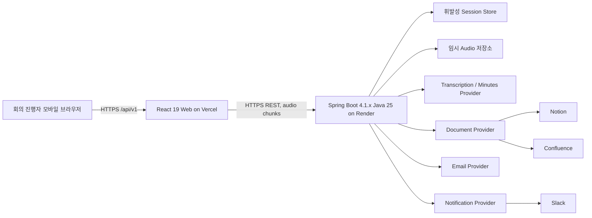

# Meeting Automation Architecture

> **문서 역할:** PRD의 시스템 구조, 경계, 런타임 흐름을 구현 가능한 수준으로 정의한다.
> **기준 문서:** [PRD.md](./PRD.md)
> **적용 범위:** Meeting Automation V1
> **기준일:** 2026-10-04

## 문서 경계

- 제품 목표, 사용자 시나리오, 범위, 확정 의사결정은 [PRD.md](./PRD.md)가 기준이다.
- 엔티티와 직렬화 형태는 [data-spec.md](./data-spec.md)가 기준이다.
- HTTP 계약은 [api-spec.md](./api-spec.md)가 기준이다.
- 외부 Provider 포트와 Adapter 동작은 [integrations.md](./integrations.md)가 기준이다.
- 이 문서는 서비스와 런타임의 경계 및 흐름을 정의하며 위 문서의 세부 계약을 중복 정의하지 않는다.

## 시스템 경계



V1은 단일 회사용 모바일 웹이다. 브라우저는 녹음 권한 획득, MediaRecorder 운용, chunk 임시 보관/전송, 검토 UI를 담당한다. Backend는 업무 규칙, 세션 상태, Audio assembly, AI 호출, 문서/메일/알림 연동을 담당한다. Provider Secret은 Backend만 보유한다.

## 런타임 및 배포 단위

| 단위 | 기준 | 책임 |
|---|---|---|
| Frontend | Node.js 22 LTS, React 19, TypeScript 5.x, Vite 7.x, npm | 모바일 UI, 녹음 제어, 재전송 가능한 chunk queue, REST 호출 |
| Backend | Java 25, Spring Boot 4.1.x, Gradle 9.x (9.1+) | REST API, workflow orchestration, Provider Adapter |
| Frontend 배포 | Vercel | 정적 웹 자산 제공 |
| Backend 배포 | Render | Spring Boot 프로세스와 임시 작업 공간 제공 |
| 외부 영속 저장 | Notion 또는 Confluence | Participant와 완료된 회의 문서의 Source of Truth |

Frontend와 Backend는 독립 build/deploy한다. Node.js는 Frontend toolchain이며 업무 API 서버가 아니다. 데이터베이스, JPA, Redis, queue, message broker, batch는 도입하지 않는다.

## Backend 구성과 의존성 방향

권장 패키지 경계:

```text
domain/
  meeting/ participant/ transcript/ minutes/ delivery/
application/
  usecase/ port/in/ port/out/
adapter/in/web/
adapter/out/ai/ document/ email/ notification/ storage/
configuration/
```

- `domain`: 상태 전이, 값 객체, 도메인 규칙. 외부 SDK와 Spring Web 타입을 참조하지 않는다.
- `application`: 유스케이스 실행과 트랜잭션 경계. Port에만 의존한다.
- `adapter/in/web`: API DTO, validation, HTTP status/header 변환.
- `adapter/out/*`: 외부 API 및 임시 저장소 구현. Provider 타입은 Adapter 내부 DTO에서 표준 DTO로 변환한다.
- `configuration`: 환경 설정, Provider 선택, CORS, HTTP client, 실행기 구성.

의존성은 `adapter → application → domain` 방향으로만 흐른다. Provider 구현 교체가 Domain/API DTO 변경을 요구하지 않도록 한다. 외부 HTTP client는 프로젝트에서 선택한 한 가지 기본 방식(Spring RestClient 또는 Apache HttpClient5)을 공통 사용한다.

## 핵심 컴포넌트 책임

| 컴포넌트 | 책임 | 소유하지 않는 책임 |
|---|---|---|
| Meeting API | 입력 검증, 상태/버전 검사, 유스케이스 호출 | Provider별 payload 구성 |
| Meeting Workflow | 상태 전이와 처리 순서 조정 | 장기 영속화 보장 |
| Session Store | 진행 중 Session 및 최대 100건 미만 목록 캐시 보관 | 서비스 재시작 후 복구 |
| Audio Service | sequence 검증, chunk 조립, MIME/크기 검증, 처리 후 삭제 | 원본 Audio 장기 보관 |
| Template Service | `default.md`, `project.md` 로딩과 버전 관리 | Provider 문서 템플릿 저장 |
| Transcription Port | Audio → 표준 Transcript/Speaker 결과 | 실제 Participant 식별 |
| Minutes Port | Transcript, mapping, template 입력 → 구조화 Minutes | 근거 없는 사실/담당자 추론 허용 |
| Document Port | Participant와 Meeting 읽기/쓰기 | 앱 전용 DB 역할 |
| Delivery Ports | Email 및 Notification 개별 전송 결과 | 채널 간 결과를 하나로 합치기 |

## 주요 흐름

### 회의 생성부터 검토까지

1. Frontend가 Participant roster와 Template을 조회하고 Session을 생성한다.
2. Backend는 `CREATED` Session을 메모리에 만들고 upload policy를 반환한다.
3. Browser는 녹음 데이터를 순서 번호가 있는 chunk로 임시 저장하고 업로드한다. ACK 받은 chunk만 로컬 재전송 대기열에서 제거한다.
4. 종료 시 Frontend는 expected chunk 수와 녹음 정보를 보내 processing을 시작한다.
5. Backend는 누락 sequence 확인 후 Audio를 조립하고 STT/diarization을 호출한다.
6. 변환 실패면 서버는 실패 stage/retryability와 Audio 만료 시각을 저장한다. 사용자가 명시적으로 재시도하면 실패 stage부터 재개한다. 만료 전 사용자는 원본 Audio를 내려받고 실패 종료를 선택할 수 있다.
7. Provider 결과를 표준 Transcript와 internal `speakerId`로 변환한다. Transcript 원문은 `speakerId`를 계속 보존한다.
8. Minutes Provider에 Transcript, Speaker mapping, 선택 Template을 전달하고 구조화 결과를 Session에 둔다.
9. Frontend는 상태 polling으로 검토 데이터를 받고 Speaker 단위 mapping 및 Minutes 편집을 수행한다.

### Template 재생성

재생성은 기존 Transcript와 현재 Speaker mapping 및 선택 Template만 입력으로 사용한다. Audio assembly, STT, diarization은 실행하지 않는다. 생성 요청은 기존 사용자 편집 내용을 덮어쓸 수 있으므로 UI가 확인을 받은 뒤 API를 호출한다.

### 저장 및 전달

1. Review Confirm은 모든 감지 Speaker mapping과 Minutes 구조를 검증하고 Session을 `CONFIRMED`로 전이한다.
2. Publish는 먼저 Document를 생성하거나 같은 Session ID의 기존 문서를 찾아 재사용한다.
3. Document 저장 성공 뒤 Email 수신자별 delivery와 선택적 Slack notification을 실행한다. 두 채널 결과는 서로 독립적이다.
4. 완료 상태와 실패한 개별 delivery를 기록한다. 재시도는 실패한 단계만 수행한다.
5. 성공 시 Audio 임시 파일은 Review 진입 때 삭제한다. 처리 실패 시 필요한 chunks/Audio를 idle 기준 마지막 실패 뒤 최대 24시간 보존하고, 명시 retry가 실행 중일 때는 만료 sweep을 멈춘다. 재시도 실패 때 만료를 갱신한다. 명시적 실패 종료 또는 만료 후 정리한다. Transcript/Minutes 본문은 일반 로그나 Admin Slack으로 내보내지 않는다.
6. 변환 실패 종료 시 회의 메타데이터와 실패 요약만 Meeting 문서에 기록한다. Email/Slack을 참석자에게 전달하지 않는다. 정상 변환 회의는 기존 Confirm/Publish 흐름을 따른다.

## 세션 상태 및 동시성

허용 상태는 PRD의 상태도를 따른다: `CREATED → RECORDING → UPLOADING → PROCESSING → REVIEW → CONFIRMED → PUBLISHING → DOCUMENT_SAVED → DELIVERING → COMPLETED | COMPLETED_WITH_WARNINGS`. 실패 상태는 `PROCESSING_FAILED`, `DOCUMENT_FAILED`이며 해당 단계 재시도로 진행 상태로 돌아간다.

- 상태 변경은 유스케이스 경계에서만 수행한다.
- 클라이언트가 전달한 `If-Match` Session version이 현재 값과 다르면 변경을 거절한다.
- 성공한 변경마다 version을 증가시킨다.
- API에서 허용하지 않은 상태의 명령은 `SESSION_STATE_CONFLICT`로 반환한다.
- Session이 메모리에만 있으므로 Backend 재시작 시 진행 중 작업 복구는 보장하지 않는다. 이는 DB 없는 V1 운영 전제이며 운영 전 배포 특성과 임시 파일 보존을 확인한다.

## 재시도와 중복 방지

- 상태를 바꾸거나 외부 부작용을 유발하는 요청은 가능한 경우 `Idempotency-Key`를 요구한다.
- Chunk 업로드는 `(sessionId, sequence, checksum)` 기준으로 중복 요청을 멱등 처리한다. 같은 sequence의 다른 checksum은 충돌이다.
- Publish의 외부 중복 방지 키는 `externalSessionId`다. 기존 문서 조회 후 없을 때만 생성한다.
- 이미 성공한 Email/Notification delivery는 재시도하지 않는다.
- 재시도 안전성이 확인되지 않은 Provider 오류는 자동 무한 재시도하지 않고 사용자/API 결과에 실패로 노출한다.

## 보안 및 관측성

- HTTPS만 사용한다. CORS는 `ALLOWED_ORIGINS`로 제한한다.
- Secret은 Render 환경 설정에 두고 Frontend 설정 및 API 응답에 포함하지 않는다.
- 일반 로그에는 `traceId`, `sessionId`, stage, 안전한 오류 코드/메시지만 기록한다.
- Audio, Transcript, Minutes, Authorization 값, webhook URL, 전체 이메일 주소는 로그 및 Admin Slack에서 제외하거나 마스킹한다.
- 네 가지 운영 오류 분류는 `PROCESSING_FAILURE`, `DOCUMENT_FAILURE`, `EMAIL_FAILURE`, `NOTIFICATION_FAILURE`다.
- `X-Request-Id`가 오면 trace correlation에 활용하고 없으면 Backend가 trace ID를 만든다.

## 용량 및 제한

제품 운영 가정은 누적 회의 100개 미만, 최대 녹음 60분이다. 업로드 chunk 길이, 최대 chunk 크기, 허용 MIME type은 App Config/Session 생성 응답이 제공하는 정책을 따른다. Provider의 페이지 크기 제한은 Adapter 안에서 처리하여 최대 100건 미만의 회의 목록을 반환한다.

## 구현 추적

이 문서의 구현 기반은 PRD의 `DEC-001~020`, `NFR-004~014`, `TASK-001`, `TASK-005~017`이다. 모바일 실기기와 회의실 품질 검증은 PRD `TASK-018~019`에서 수행한다.
